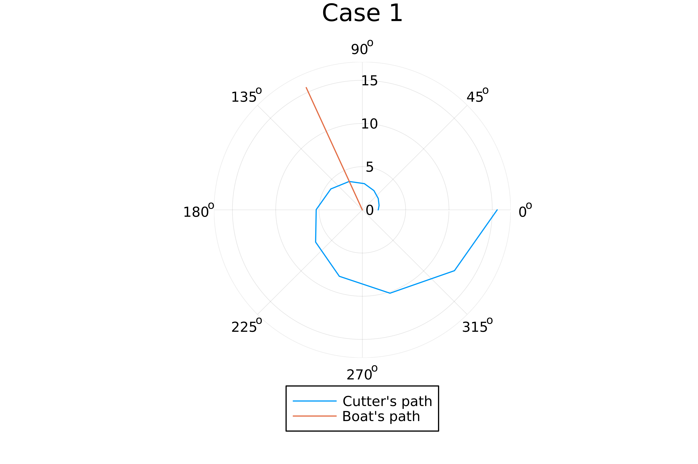

---
## Front matter
title: "Отчет по лабораторной работе 1"
subtitle: ""
author: "Матюхин Григорий Васильевич"

## Generic otions
lang: ru-RU
toc-title: "Содержание"

## Bibliography
bibliography: bib/cite.bib
csl: pandoc/csl/gost-r-7-0-5-2008-numeric.csl

## Pdf output format
toc: true # Table of contents
toc-depth: 2
lof: true # List of figures
lot: true # List of tables
fontsize: 12pt
linestretch: 1.5
papersize: a4
documentclass: scrreprt
## I18n polyglossia
polyglossia-lang:
  name: russian
  options:
	- spelling=modern
	- babelshorthands=true
polyglossia-otherlangs:
  name: english
## I18n babel
babel-lang: russian
babel-otherlangs: english
## Fonts
mainfont: PT Serif
romanfont: PT Serif
sansfont: PT Sans
monofont: PT Mono
mainfontoptions: Ligatures=TeX
romanfontoptions: Ligatures=TeX
sansfontoptions: Ligatures=TeX,Scale=MatchLowercase
monofontoptions: Scale=MatchLowercase,Scale=0.9
## Biblatex
biblatex: true
biblio-style: "gost-numeric"
biblatexoptions:
  - parentracker=true
  - backend=biber
  - hyperref=auto
  - language=auto
  - autolang=other*
  - citestyle=gost-numeric
## Pandoc-crossref LaTeX customization
figureTitle: "Рис."
tableTitle: "Таблица"
listingTitle: "Листинг"
lofTitle: "Список иллюстраций"
lotTitle: "Список таблиц"
lolTitle: "Листинги"
## Misc options
indent: true
header-includes:
  - \usepackage{indentfirst}
  - \usepackage{float} # keep figures where there are in the text
  - \floatplacement{figure}{H} # keep figures where there are in the text
---

# Цель работы

Решить задачу о погоне используя Openmodelica и Julia.

# Постановка задачи

Мой вариант: $1032211403 \% 70 + 1 = 14$

На море в тумане катер береговой охраны преследует лодку браконьеров. Через определенный промежуток времени туман рассеивается, и лодка обнаруживается на расстоянии 7,5 км от катера. Затем лодка снова скрывается в тумане и уходит прямолинейно в неизвестном направлении. Известно, что скорость
катера в 3,1 раза больше скорости браконьерской лодки.
1. Запишите уравнение, описывающее движение катера, с начальными условиями для двух случаев (в зависимости от расположения катера относительно лодки в начальный момент времени).
2. Постройте траекторию движения катера и лодки для двух случаев.
3. Найдите точку пересечения траектории катера и лодки

# Выполнение лабораторной работы

## Решение задачи
1. Принимаем за $t_0 = 0, x_{b0} = 0$ -- место нахождения лодки браконьеров в момент обнаружения, $x_{c0} = 0$ -- место нахождения катера береговой охраны относительно лодки браконьеров в момент обнаружения лодки.
2. Введем полярные координаты. Считаем, что полюс -- это точка обнаружения лодки браконьеров $x_{b0} (\theta = x_{b0} = 0)$, а полярная ось $r$ проходит через точку нахождения катера береговой охраны.
3. Траектория катера должна быть такой, чтобы и катер, и лодка все время были на одном расстоянии от полюса $\theta$ , только в этом случае траектория катера пересечется с траекторией лодки.
Поэтому для начала катер береговой охраны должен двигаться некоторое время прямолинейно, пока не окажется на том же расстоянии от полюса, что и лодка браконьеров. После этого катер береговой охраны должен двигаться вокруг полюса удаляясь от него с той же скоростью, что и лодка браконьеров.
4. Чтобы найти расстояние $x$ (расстояние после которого катер начнет двигаться вокруг полюса), необходимо составить простое уравнение. Пусть через время $t$ катер и лодка окажутся на одном расстоянииx от полюса. За это время лодка пройдет $x$ , а катерk $k - x$ (или $k + x$ , в зависимости от начального положения катера относительно полюса). Время, за которое они пройдут это расстояние, вычисляется как $x \div v% или $(k - x) \div 3.1v$ (во втором случае $(k + x) \div 3.1v$ ). Так как время одно и то же, то эти величины одинаковы. Тогда неизвестное расстояниеx можно найти из следующего уравнения:

$\frac{x}{v} = \frac{k - x}{3.1v}$ в первом случае
или
$\frac{x}{v} = \frac{k + x}{3.1v}$ во втором.

Отсюда мы найдем два значения $x_1 = \frac{k}{4.1}$ и $x_2 = \frac{k}{2.1}$, задачу будем решать для двух случаев.
5. После того, как катер береговой охраны окажется на одном расстоянии от полюса, что и лодка, он должен сменить прямолинейную траекторию и начать двигаться вокруг полюса удаляясь от него со скоростью лодки $v$. Для этого скорость катера раскладываем на две составляющие: $r_v$ -- радиальная скорость и $v_t$ -- тангенциальная скорость.
Радиальная скорость -- это скорость, с которой катер удаляется от полюса, $v_r = \frac{dr}{dt}$. Нам нужно, чтобы эта скорость была равна скорости лодки, поэтому полагаем $\frac{dr}{dt} = v$.
Тангенциальная скорость -- это линейная скорость вращения катера относительно полюса. Она равна произведению угловой скорости $\frac{d\theta}{dt}$ на радиус $r$, $v_t = r\frac{d\theta}{dt}$.
$v_t = \sqrt{(4.1v)^2 - v^2} = v\sqrt{15.81}$ (учитывая, что радиальная скорость равна $v$ ). Тогда получаем $r\frac{d\theta}{dt} = v\sqrt{15.81}$.
6. Решение исходной задачи сводится к решению системы из двух
дифференциальных уравнений

$\begin{cases} \frac{dr}{dt} = v \\ r\frac{d\theta}{dt} = v\sqrt{15.81} \end{cases}$

с начальными условиями

$\begin{cases} \theta_0 = 0 \\ r_0 = x_1 \end{cases}$

или

$\begin{cases} \theta_0 = -\pi \\ r_0 = x_2 \end{cases}$
Исключая из полученной системы производную по t, можно перейти к
следующему уравнению:

$\frac{dr}{d\theta} = \frac{r}{\sqrt{15.81}}$

Начальные условия остаются прежними. Решив это уравнение, вы получите
траекторию движения катера в полярных координатах.

## Код программы

```julia
using Plots
using DifferentialEquations

const sighting_distance = 7.5 
const cutter_speed_coef = 3.1
const phi = 2

const r0 = sighting_distance / (cutter_speed_coef + 1)
const r1 = sighting_distance / (cutter_speed_coef - 1)

const T0 = (0, 2*pi)
const T1 = (-pi, pi)

function chase_problem(r0, T)
  v_t = sqrt(cutter_speed_coef ^ 2 - 1)
  dr(r, p, theta) = r / v_t
  problem = ODEProblem(dr, r0, T)
  return solve(problem, abstol=1e-8, reltol=1e-8)
end

function draw_plot(title, result)
  plt = plot(proj=:polar, aspect_ratio=:equal, dpi = 1000, legend=:outerbottom, bg=:white, title=title)
  plot!(plt, result.t, result.u, label="Cutter's path")
  plot!(plt, [phi, phi], [0, last(result.u)], label="Boat's path")
  savefig(plt, lowercase(string(replace(title, " "=>"_"), ".png")))
end

# Case 1
result = chase_problem(r0, T0)
draw_plot("Case 1", result)

# Case 2
result = chase_problem(r1, T1)
draw_plot("Case 2", result)
```

## Результаты ваполнения

### Первый случай


### Второй случай


# Выводы
Мы смогли реализовать решение задачи о погоне.
