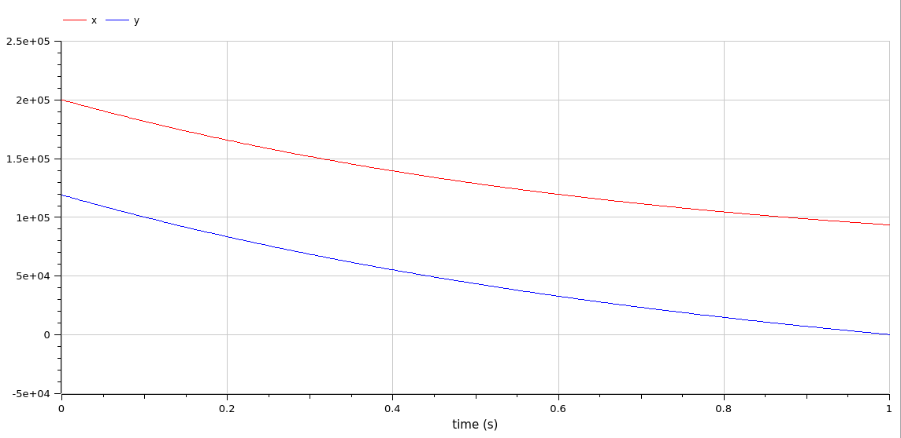
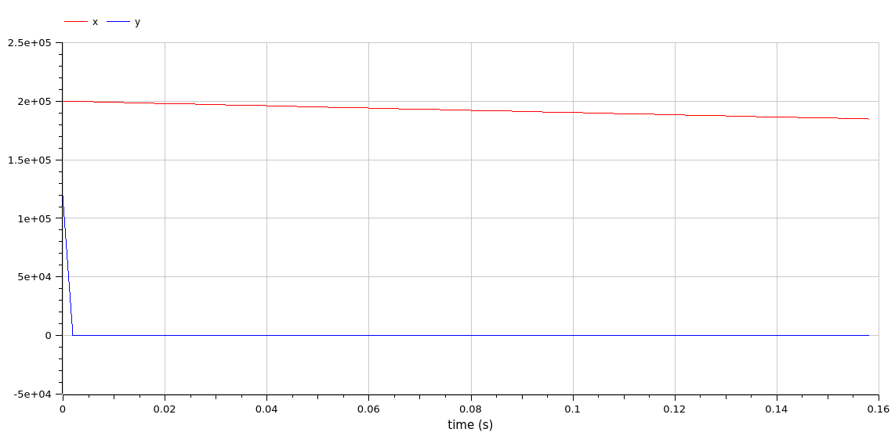
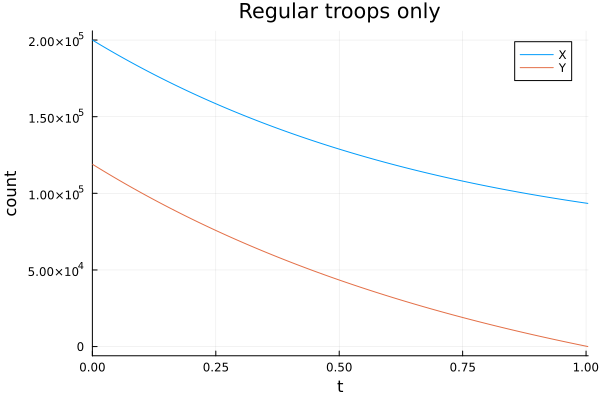
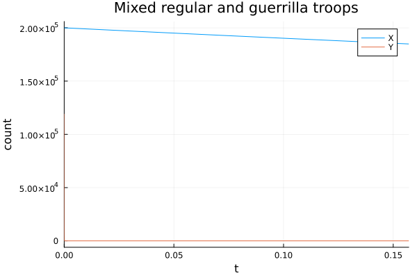

---
## Front matter
lang: ru-RU
title: Презентация по лабораторной работе 3
subtitle: 
author:
  - Матюхин Г. В.
institute:
  - Российский университет дружбы народов, Москва, Россия
date: 10 февраля 2024

## i18n babel
babel-lang: russian
babel-otherlangs: english

## Formatting pdf
toc: false
toc-title: Содержание
slide_level: 2
aspectratio: 169
section-titles: true
theme: metropolis
header-includes:
 - \metroset{progressbar=frametitle,sectionpage=progressbar,numbering=fraction}
 - \usepackage{fvextra}
 - \DefineVerbatimEnvironment{Highlighting}{Verbatim}{breaklines,commandchars=\\\{\}}
 - '\makeatletter'
 - '\beamer@ignorenonframefalse'
 - '\makeatother'
---
# Цель работы

Смоделировать изменение численностей армий во время боевых действий.

## Постановка задачи (1/2)

Между страной $X$ и страной $Y$ идет война. Численность состава войск исчисляется от начала войны, и являются временными функциями $x(t)$ и $y(t)$. В начальный момент времени страна $X$ имеет армию численностью $200000$ человек, а в распоряжении страны $Y$ армия численностью в $119000$ человек. Для упрощения модели считаем, что коэффициенты $a,b,c,h$ постоянны. Также считаем $P(t)$ и $Q(t)$ непрерывные функции.

## Постановка задачи (2/2)

Постройте графики изменения численности войск армии $X$ и армии $Y$ для следующих случаев:

1. Модель боевых действий между регулярными войсками
    $\frac{dx}{dt} = -0.5x(t) - 0.8y(t) + sin(t + 5) + 1$
    $\frac{dy}{dt} = -0.7x(t) - 0.5y(t) + cos(t + 3) + 1$

2. Модель ведение боевых действий с участием регулярных войск и партизанских отрядов
    $\frac{dx}{dt} = -0.5x(t) - 0.8y(t) + sin(10t)$

    $\frac{dy}{dt} = -0.3x(t)y(t) - 0.5y(t) + cos(10t)$

# Выполнение работы

В этой работе требуется найти решения двух систем дифференциальных уравнений, которые даны в задании.

## OpenModelica

### Модель без партизан

```
model war
  Real x(start=200000);
  Real y(start=119000);
equation
  der(x) = -0.5*x - 0.8*y + sin(time +5) + 1;
  der(y) = -0.7*x  - 0.5*y + cos(time + 5) + 1;
  
  if x<=0 then
    terminate("X was defeated");
  end if;
  if y<=0 then
    terminate("Y was defeated");
  end if;
end war;
```

### Результат



### Модель с партизанами

```
model war_guerrilla
  Real x(start=200000);
  Real y(start=119000);
equation
  der(x) = -0.5*x - 0.8*y + sin(10*time);
  der(y) = -0.3*x*y - 0.5*y + cos(10*time);
  
  if x<=0 then
    terminate("X was defeated");
  end if;
  if y<=0 then
    terminate("Y was defeated");
  end if;
end war_guerrilla;
```

### Результат



## Julia[^1]

### Модель без партизан

```julia
function model_war(du, u0, p, t)
  x = u0[1]
  y = u0[2]
  dx = -0.5*x - 0.8*y + sin(t + 5) + 1
  dy = -0.7*x - 0.5*y + cos(t + 3) + 1
  du[1] = dx
  du[2] = dy
end

war_prob = ODEProblem(model_war, u0, t, callback=cb)
war_sol = solve(war_prob, abstol=1e-15, dt=0.0001)
```

### Результат



### Модель с партизанами

```julia
function model_war_guerrilla(du, u0, p, t)
  x = u0[1]
  y = u0[2]
  dx = -0.5*x - 0.8*y + sin(10*t)
  dy = -0.3*x*y - 0.5*y + cos(10*t)
  du[1] = dx
  du[2] = dy
end

war_guerrilla_prob = ODEProblem(model_war_guerrilla, u0, t, callback=cb)
war_guerrilla_sol = solve(war_guerrilla_prob, abstol=1e-15, dt=0.0001)
```

### Результат



## Сравнение

Как можно увидеть, результаты моелирования как при использовании OpenModelica, так и при использовании Julia идентичны.

# Вывод

В данной лабораторной работе мы реализовали модель потерь при велении войны.

