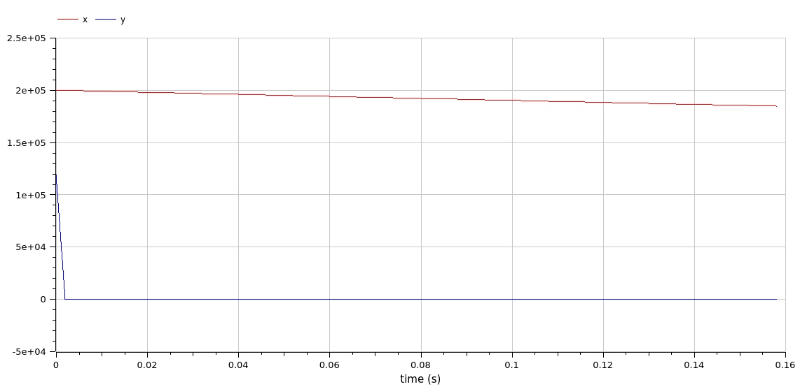
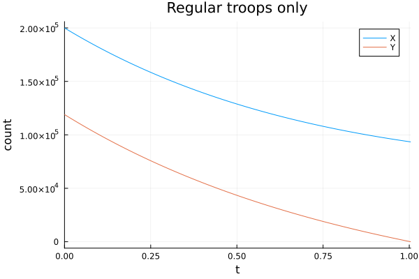

---
## Front matter
title: "Отчет по лабораторной работе 2"
subtitle: ""
author: "Матюхин Григорий Васильевич"

## Generic otions
lang: ru-RU
toc-title: "Содержание"

## Bibliography
bibliography: bib/cite.bib
csl: pandoc/csl/gost-r-7-0-5-2008-numeric.csl

## Pdf output format
toc: true # Table of contents
toc-depth: 2
lof: true # List of figures
lot: true # List of tables
fontsize: 12pt
linestretch: 1.5
papersize: a4
documentclass: scrreprt
## I18n polyglossia
polyglossia-lang:
  name: russian
  options:
	- spelling=modern
	- babelshorthands=true
polyglossia-otherlangs:
  name: english
## I18n babel
babel-lang: russian
babel-otherlangs: english
## Fonts
mainfont: PT Serif
romanfont: PT Serif
sansfont: PT Sans
monofont: PT Mono
mainfontoptions: Ligatures=TeX
romanfontoptions: Ligatures=TeX
sansfontoptions: Ligatures=TeX,Scale=MatchLowercase
monofontoptions: Scale=MatchLowercase,Scale=0.9
## Biblatex
biblatex: true
biblio-style: "gost-numeric"
biblatexoptions:
  - parentracker=true
  - backend=biber
  - hyperref=auto
  - language=auto
  - autolang=other*
  - citestyle=gost-numeric
## Pandoc-crossref LaTeX customization
figureTitle: "Рис."
tableTitle: "Таблица"
listingTitle: "Листинг"
lofTitle: "Список иллюстраций"
lotTitle: "Список таблиц"
lolTitle: "Листинги"
## Misc options
indent: true
header-includes:
  - \usepackage{indentfirst}
  - \usepackage{float} # keep figures where there are in the text
  - \floatplacement{figure}{H} # keep figures where there are in the text
---

# Цель работы

Смоделировать изменение численностей армий во время боевых действий.

## Постановка задачи

Мой номер студенческого билета 1032211402, всего заданий 70, значит мой вариант 14.

Между страной $X$ и страной $Y$ идет война. Численность состава войск исчисляется от начала войны, и являются временными функциями $x(t)$ и $y(t)$. В начальный момент времени страна $X$ имеет армию численностью $200000$ человек, а в распоряжении страны $Y$ армия численностью в $119000$ человек. Для упрощения модели считаем, что коэффициенты $a,b,c,h$ постоянны. Также считаем $P(t)$ и $Q(t)$ непрерывные функции.

Постройте графики изменения численности войск армии $X$ и армии $Y$ для следующих случаев:

1. Модель боевых действий между регулярными войсками
    $\frac{dx}{dt} = -0.5x(t) - 0.8y(t) + sin(t + 5) + 1$
    $\frac{dy}{dt} = -0.7x(t) - 0.5y(t) + cos(t + 3) + 1$

2. Модель ведение боевых действий с участием регулярных войск и партизанских отрядов
    $\frac{dx}{dt} = -0.5x(t) - 0.8y(t) + sin(10t)$
    $\frac{dy}{dt} = -0.3x(t)y(t) - 0.5y(t) + cos(10t)$

# Выполнение работы

В этой работе требуется найти решения двух систем дифференциальных уравнений, которые даны в задании.

## OpenModelica

### Модель без партизан

```
model war
  Real x(start=200000);
  Real y(start=119000);
equation
  der(x) = -0.5*x - 0.8*y + sin(time +5) + 1;
  der(y) = -0.7*x  - 0.5*y + cos(time + 5) + 1;
  
  if x<=0 then
    terminate("X was defeated");
  end if;
  if y<=0 then
    terminate("Y was defeated");
  end if;
end war;
```


### Модель с партизанами

```
model war_guerrilla
  Real x(start=200000);
  Real y(start=119000);
equation
  der(x) = -0.5*x - 0.8*y + sin(10*time);
  der(y) = -0.3*x*y - 0.5*y + cos(10*time);
  
  if x<=0 then
    terminate("X was defeated");
  end if;
  if y<=0 then
    terminate("Y was defeated");
  end if;
end war_guerrilla;
```



## Julia[^1]

[^1]: В данной секции прведен только код связаный с постановкой задачи.

### Модель без партизан

```julia
using DifferentialEquations, Plots

# initial army sizes
const u0 = [200000, 119000]

t = (0, 10)

function model_war(du, u0, p, t)
  x = u0[1]
  y = u0[2]
  dx = -0.5*x - 0.8*y + sin(t + 5) + 1
  dy = -0.7*x - 0.5*y + cos(t + 3) + 1
  du[1] = dx
  du[2] = dy
end

# Stop the model when one army size reaches zero
condition1(u, t, integrator) = u[1]
cb1 = ContinuousCallback(condition1, SciMLBase.terminate!)
condition2(u, t, integrator) = u[2]
cb2 = ContinuousCallback(condition2, SciMLBase.terminate!)

cb = CallbackSet(
  ContinuousCallback(condition1, SciMLBase.terminate!),
  ContinuousCallback(condition2, SciMLBase.terminate!)
)

war_prob = ODEProblem(model_war, u0, t, callback=cb)
war_sol = solve(war_prob, abstol=1e-15, dt=0.0001)
```


### Модель с партизанами

```julia
using DifferentialEquations, Plots

# initial army sizes
const u0 = [200000, 119000]

t = (0, 10)

function model_war_guerrilla(du, u0, p, t)
  x = u0[1]
  y = u0[2]
  dx = -0.5*x - 0.8*y + sin(10*t)
  dy = -0.3*x*y - 0.5*y + cos(10*t)
  du[1] = dx
  du[2] = dy
end

# Stop the model when one army size reaches zero
condition1(u, t, integrator) = u[1]
cb1 = ContinuousCallback(condition1, SciMLBase.terminate!)
condition2(u, t, integrator) = u[2]
cb2 = ContinuousCallback(condition2, SciMLBase.terminate!)

cb = CallbackSet(
  ContinuousCallback(condition1, SciMLBase.terminate!),
  ContinuousCallback(condition2, SciMLBase.terminate!)
)

war_guerrilla_prob = ODEProblem(model_war_guerrilla, u0, t, callback=cb)
war_guerrilla_sol = solve(war_guerrilla_prob, abstol=1e-15, dt=0.0001)
```


## Сравнение

Как можно увидеть, результаты моелирования как при использовании OpenModelica, так и при использовании Julia идентичны.

# Вывод

В данной лабораторной работе мы реализовали модель потерь при велении войны.
