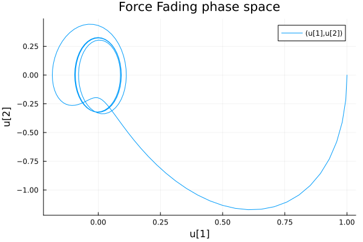
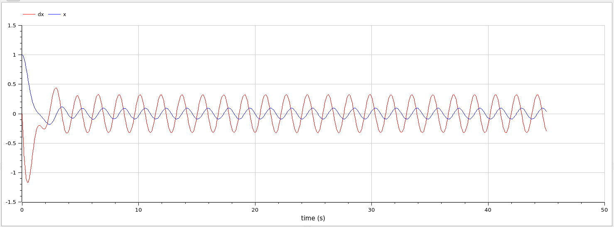
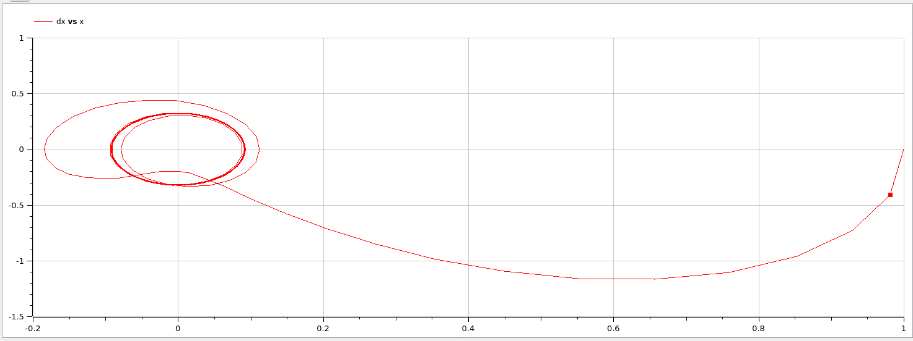

---
## Front matter
lang: ru-RU
title: Презентация по лабораторной работе 4
subtitle: 
author:
  - Матюхин Г. В.
institute:
  - Российский университет дружбы народов, Москва, Россия
date: 2 марта 2024

## i18n babel
babel-lang: russian
babel-otherlangs: english

## Formatting pdf
toc: false
toc-title: Содержание
slide_level: 2
aspectratio: 169
section-titles: true
theme: metropolis
header-includes:
 - \metroset{progressbar=frametitle,sectionpage=progressbar,numbering=fraction}
 - \usepackage{fvextra}
 - \DefineVerbatimEnvironment{Highlighting}{Verbatim}{breaklines,commandchars=\\\{\}}
 - '\makeatletter'
 - '\beamer@ignorenonframefalse'
 - '\makeatother'
---

# Цель работы

Смоделировать гармонические колебания с различными условиями.

## Постановка задачи

Вариант 14:
Постройте фазовый портрет гармонического осциллятора и решение уравнения гармонического осциллятора для следующих случаев:

1. Колебания гармонического осциллятора без затуханий и без действий внешней силы $\ddot x + 6x = 0$

2. Колебания гармонического осциллятора c затуханием и без действий внешней силы $\ddot x + 5 \dot x + 15x = 0$

3. Колебания гармонического осциллятора c затуханием и под действием внешней силы $\ddot x + 2 \dot x + 4x = \cos(3.5t)$

На интервале $t \in \left[0; 45\right]$;(шаг $0.05$) с начальными условиями $x_0 = 1,y_0 = 0$

# Выполнение работы

В этой работе требуется найти решения уравнения производной второго порядка. Решать будет как систему из двух уравнений производной первого порядка.

# Julia

```julia
function oscillation(title, g, w2, f)
  function _oscillation!(du, u, p, t)
    x = u[1]
    dx = u[2]
    du[1] = dx
    du[2] = - g * dx - w2 * x - f(t)
  end
  prob = ODEProblem(_oscillation!, u0, tspan,)
  sol = solve(prob, Tsit5(), dt=dt)

  _prob = ODEProblem(prob.f, u0, tspan)
  _sol = solve(_prob, Vern9())
end
```

## Результаты (1/2)


## Результаты (2/2)



# OpenModelica

```
model oscillation
  Real x(start = 1);
  Real dx(start = 0);
  parameter Real g = 0;
  parameter Real w2 = 6;
equation
  der(x) = dx;
  der(dx)= - g * dx - w2 * x - cos(3.5 * time);
end oscillation;
```

## Результаты

## Результаты (1/2)



## Результаты (2/2)



# Сравнение

Как можно увидеть, результаты моелирования как при использовании OpenModelica, так и при использовании Julia идентичны. Однако Julia позволяет задать проблему в более общем виде, не смодтря на относительно большее количество написанного кода.

# Вывод

В данной лабораторной работе мы реализовали модель гармонических колебаний с различными условиями.
