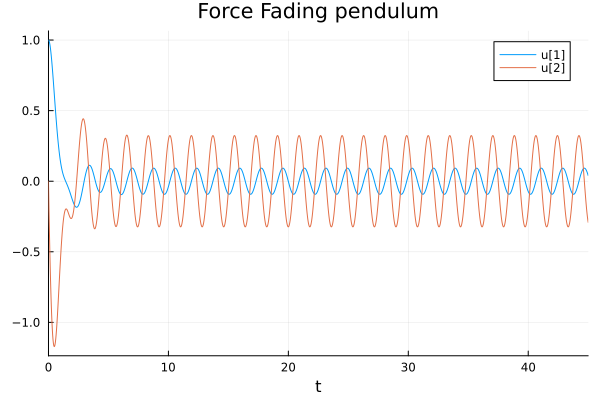
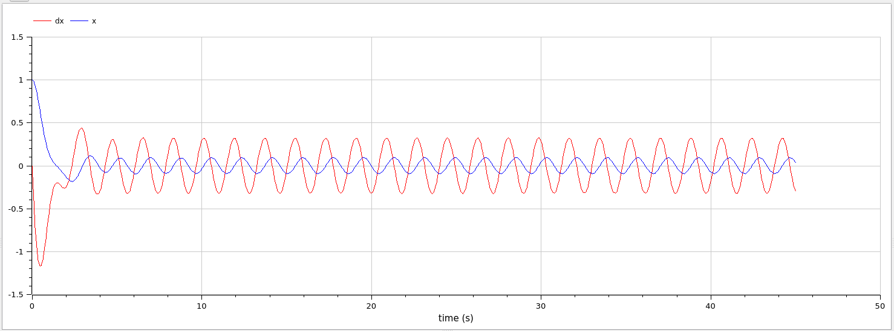

---
## Front matter
title: "Отчет по лабораторной работе 3"
subtitle: ""
author: "Матюхин Григорий Васильевич"

## Generic otions
lang: ru-RU
toc-title: "Содержание"

## Bibliography
bibliography: bib/cite.bib
csl: pandoc/csl/gost-r-7-0-5-2008-numeric.csl

## Pdf output format
toc: true # Table of contents
toc-depth: 2
lof: true # List of figures
lot: true # List of tables
fontsize: 12pt
linestretch: 1.5
papersize: a4
documentclass: scrreprt
## I18n polyglossia
polyglossia-lang:
  name: russian
  options:
	- spelling=modern
	- babelshorthands=true
polyglossia-otherlangs:
  name: english
## I18n babel
babel-lang: russian
babel-otherlangs: english
## Fonts
mainfont: PT Serif
romanfont: PT Serif
sansfont: PT Sans
monofont: PT Mono
mainfontoptions: Ligatures=TeX
romanfontoptions: Ligatures=TeX
sansfontoptions: Ligatures=TeX,Scale=MatchLowercase
monofontoptions: Scale=MatchLowercase,Scale=0.9
## Biblatex
biblatex: true
biblio-style: "gost-numeric"
biblatexoptions:
  - parentracker=true
  - backend=biber
  - hyperref=auto
  - language=auto
  - autolang=other*
  - citestyle=gost-numeric
## Pandoc-crossref LaTeX customization
figureTitle: "Рис."
tableTitle: "Таблица"
listingTitle: "Листинг"
lofTitle: "Список иллюстраций"
lotTitle: "Список таблиц"
lolTitle: "Листинги"
## Misc options
indent: true
header-includes:
  - \usepackage{indentfirst}
  - \usepackage{float} # keep figures where there are in the text
  - \floatplacement{figure}{H} # keep figures where there are in the text
---

# Цель работы

Смоделировать гармонические колебания с различными условиями.

## Постановка задачи

Вариант 14:
Постройте фазовый портрет гармонического осциллятора и решение уравнения гармонического осциллятора для следующих случаев:

1. Колебания гармонического осциллятора без затуханий и без действий внешней силы $\ddot x + 6x = 0$

2. Колебания гармонического осциллятора c затуханием и без действий внешней силы $\ddot x + 5 \dot x + 15x = 0$

3. Колебания гармонического осциллятора c затуханием и под действием внешней силы $\ddot x + 2 \dot x + 4x = \cos(3.5t)$

На интервале $t \in \left[0; 45\right]$;(шаг $0.05$) с начальными условиями $x_0 = 1,y_0 = 0$

# Выполнение работы

В этой работе требуется найти решения уравнения производной второго порядка. Решать будет как систему из двух уравнений производной первого порядка.

# Julia

```julia
using DifferentialEquations, Plots

const u0 = [1, 0]
const tspan = (0, 45)
const dt = 0.05

function oscillation(title, g, w2, f)
  function _oscillation!(du, u, p, t)
    x = u[1]
    dx = u[2]
    du[1] = dx
    du[2] = - g * dx - w2 * x - f(t)
  end

  prob = ODEProblem(_oscillation!, u0, tspan,)
  sol = solve(prob, Tsit5(), dt=dt)

  plt = plot(sol, title=string(title, " pendulum"))
  savefig(plt, lowercase(string(replace(title, " "=>"_"), "_pendulum.png")))

  _prob = ODEProblem(prob.f, u0, tspan)
  _sol = solve(_prob, Vern9())

  _plt = plot(_sol, vars = (1,2), title=string(title, " phase space"))
  savefig(_plt, lowercase(string(replace(title, " "=>"_"), "_phase.png")))
end

f(t) = 0
oscillation("Simple", 0, 6, f)

oscillation("Fading", 5, 15, f)

f(t) = cos(3.5 * t)
oscillation("Force Fading", 2, 4, f)
```

Приведенный выше код решит все три подзадачи сразу.

## Результаты

### 1


### 2


### 3




# OpenModelica

```
model oscillation
  Real x(start = 1);
  Real dx(start = 0);
  parameter Real g = 0;
  parameter Real w2 = 6;
equation
  der(x) = dx;
  der(dx)= - g * dx - w2 * x;
end oscillation;
```

Приведенный выше код решит первые две подзадачи.

Чтобы решить третью подзадачу, необходимо добавить еще одно слагаемое в формулу.

```
model oscillation
  Real x(start = 1);
  Real dx(start = 0);
  parameter Real g = 0;
  parameter Real w2 = 6;
equation
  der(x) = dx;
  der(dx)= - g * dx - w2 * x - cos(3.5 * time);
end oscillation;
```

## Результаты

### 1


### 2


### 3




# Сравнение

Как можно увидеть, результаты моелирования как при использовании OpenModelica, так и при использовании Julia идентичны. Однако Julia позволяет задать проблему в более общем виде, не смодтря на относительно большее количество написанного кода.

# Вывод

В данной лабораторной работе мы реализовали модель гармонических колебаний с различными условиями.
