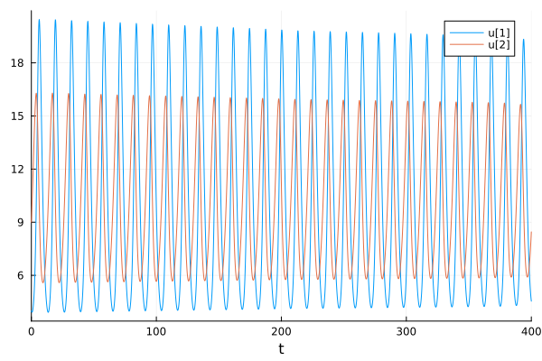
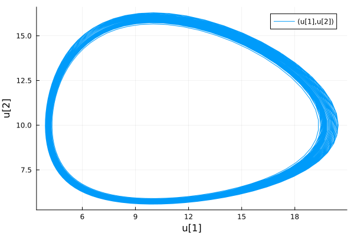
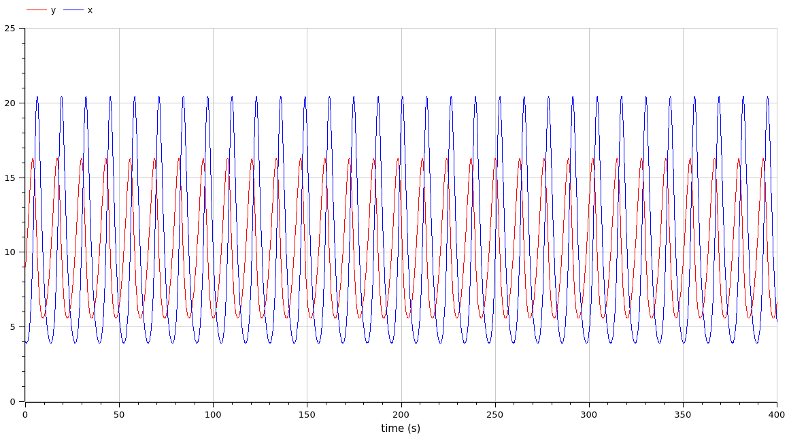
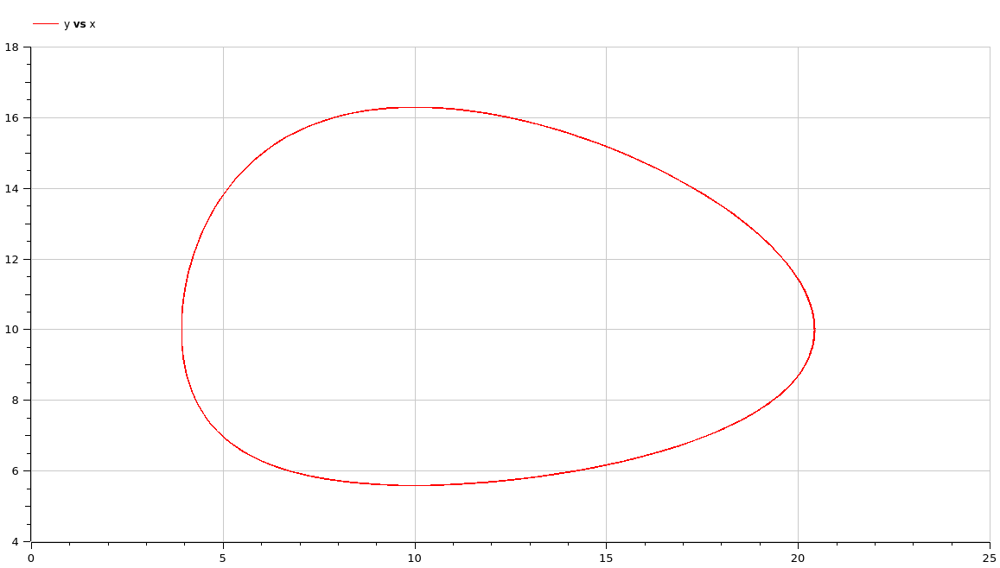

---
## Front matter
lang: ru-RU
title: Презентация по лабораторной работе 5
subtitle: 
author:
  - Матюхин Г. В.
institute:
  - Российский университет дружбы народов, Москва, Россия
date: 2 марта 2024

## i18n babel
babel-lang: russian
babel-otherlangs: english

## Formatting pdf
toc: false
toc-title: Содержание
slide_level: 2
aspectratio: 169
section-titles: true
theme: metropolis
header-includes:
 - \metroset{progressbar=frametitle,sectionpage=progressbar,numbering=fraction}
 - \usepackage{fvextra}
 - \DefineVerbatimEnvironment{Highlighting}{Verbatim}{breaklines,commandchars=\\\{\}}
 - '\makeatletter'
 - '\beamer@ignorenonframefalse'
 - '\makeatother'
---

# Цель работы

Рассмотреть модель типа "хищник-жертва" Лотки-Вольтерры.

## Постановка задачи

Вариант 14:
Для модели "хищник-жертва":

$$
\begin{cases}
    \frac{dx}{dt} = -0.77x(t) + 0.077x(t)y(t) \\
    \frac{dy}{dt} = 0.33y(t) - 0.033x(t)y(t)
\end{cases}
$$

Постройте график зависимости численности хищников от численности жертв, а также графики изменения численности хищников и численности жертв при следующих начальных условия $x_0 = 4, y_0 = 9$. Найдите стационарное состояние системы.

# Выполнение работы

В этой работе требуется найти решения системы уравнений производной первого порядка.

# Julia

```julia
using DifferentialEquations, Plots

function predator_prey!(du, u, p, t)
  x = u[1]
  y = u[2]
  du[1] = -a * x + c * x * y
  du[2] = b * y - d * x * y
end

prob = ODEProblem(predator_prey!, u0, tspan, dt=dt)
sol = solve(prob)

_plt = plot(sol, idxs = (1,2))
savefig(_plt, "predator_prey_dependency.png")
```

## Результаты (1/2)



## Результаты (2/2)



# OpenModelica

```
model ecosystem
  Real x(start = 4);
  Real y(start = 9);
  parameter Real a = 0.77;
  parameter Real b = 0.33;
  parameter Real c = 0.077;
  parameter Real d = 0.033;
equation
  der(x) = - a * x + c * x * y;
  der(y) = b * y - d * x * y;
end ecosystem;
```

## Результаты (1/2)



## Результаты (2/2)



# Сравнение

Как можно увидеть, результаты моделирования как при использовании OpenModelica, так и при использовании Julia идентичны за исключением точности.

# Вывод

В данной лабораторной работе мы рассмотрели модель типа "хищник-жертва" Лотки-Вольтерры.
