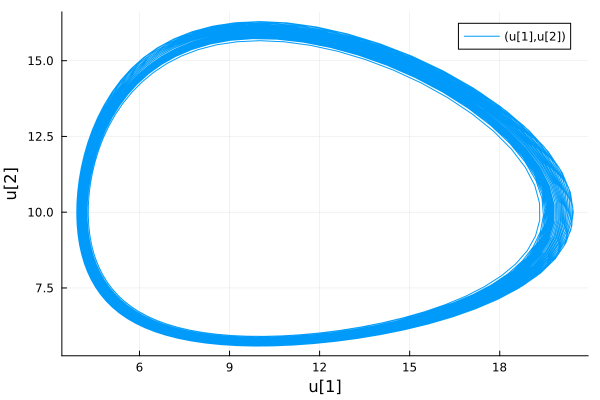
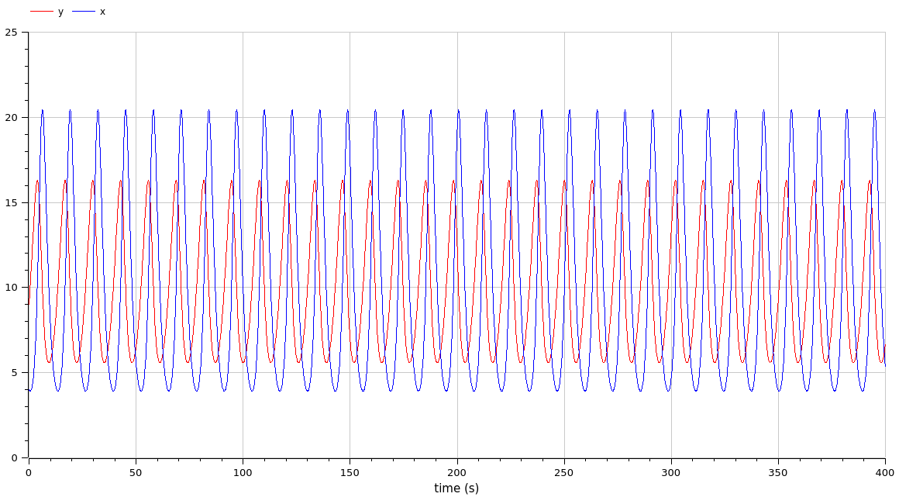
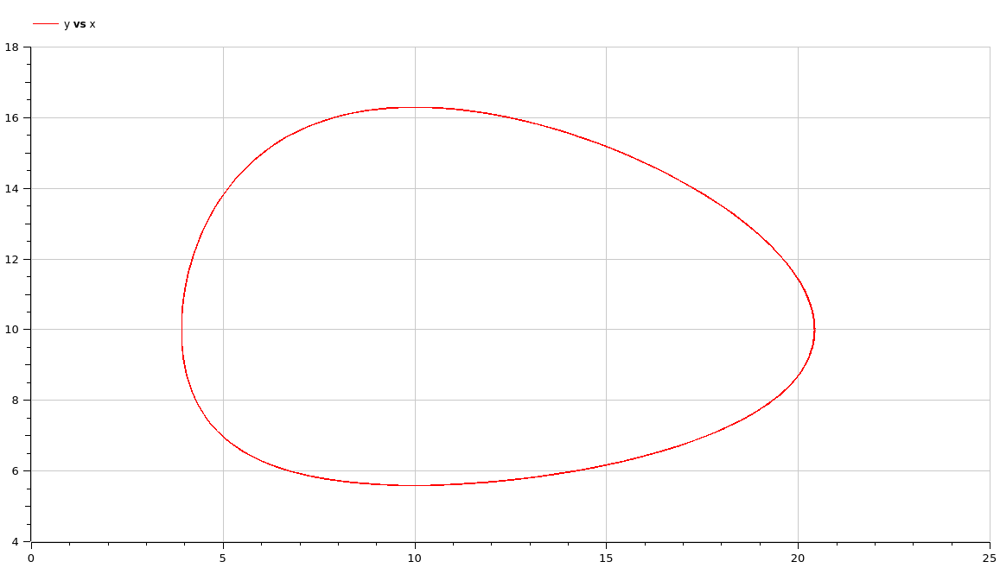

---
## Front matter
title: "Отчет по лабораторной работе 5"
subtitle: ""
author: "Матюхин Григорий Васильевич"

## Generic otions
lang: ru-RU
toc-title: "Содержание"

## Bibliography
bibliography: bib/cite.bib
csl: pandoc/csl/gost-r-7-0-5-2008-numeric.csl

## Pdf output format
toc: true # Table of contents
toc-depth: 2
lof: true # List of figures
lot: true # List of tables
fontsize: 12pt
linestretch: 1.5
papersize: a4
documentclass: scrreprt
## I18n polyglossia
polyglossia-lang:
  name: russian
  options:
	- spelling=modern
	- babelshorthands=true
polyglossia-otherlangs:
  name: english
## I18n babel
babel-lang: russian
babel-otherlangs: english
## Fonts
mainfont: PT Serif
romanfont: PT Serif
sansfont: PT Sans
monofont: PT Mono
mainfontoptions: Ligatures=TeX
romanfontoptions: Ligatures=TeX
sansfontoptions: Ligatures=TeX,Scale=MatchLowercase
monofontoptions: Scale=MatchLowercase,Scale=0.9
## Biblatex
biblatex: true
biblio-style: "gost-numeric"
biblatexoptions:
  - parentracker=true
  - backend=biber
  - hyperref=auto
  - language=auto
  - autolang=other*
  - citestyle=gost-numeric
## Pandoc-crossref LaTeX customization
figureTitle: "Рис."
tableTitle: "Таблица"
listingTitle: "Листинг"
lofTitle: "Список иллюстраций"
lotTitle: "Список таблиц"
lolTitle: "Листинги"
## Misc options
indent: true
header-includes:
  - \usepackage{indentfirst}
  - \usepackage{float} # keep figures where there are in the text
  - \floatplacement{figure}{H} # keep figures where there are in the text
---

# Цель работы

Рассмотреть модель типа "хищник-жертва" Лотки-Вольтерры.

## Постановка задачи

Вариант 14:
Для модели "хищник-жертва":

$$
\begin{cases}
    \frac{dx}{dt} = -0.77x(t) + 0.077x(t)y(t) \\
    \frac{dy}{dt} = 0.33y(t) - 0.033x(t)y(t)
\end{cases}
$$

Постройте график зависимости численности хищников от численности жертв, а также графики изменения численности хищников и численности жертв при следующих начальных условия $x_0 = 4, y_0 = 9$. Найдите стационарное состояние системы.

# Выполнение работы

В этой работе требуется найти решения системы уравнений производной первого порядка.

# Julia

```julia
using DifferentialEquations, Plots

const tspan = (0, 400)
const u0 = [4, 9]
const dt = 0.1

const a = 0.77
const b = 0.33
const c = 0.077
const d = 0.033

function predator_prey!(du, u, p, t)
  x = u[1]
  y = u[2]
  du[1] = -a * x + c * x * y
  du[2] = b * y - d * x * y
end

prob = ODEProblem(predator_prey!, u0, tspan, dt=dt)
sol = solve(prob)

plt = plot(sol)
savefig(plt, "population_change.png")

_plt = plot(sol, idxs = (1,2))
savefig(_plt, "predator_prey_dependency.png")
```

## Результаты




На графе выше можно увидеть достаточно шорокие линии. Я подозреваю это вызвано недостатком точности решателя уравненения.

# OpenModelica

```
model ecosystem
  Real x(start = 4);
  Real y(start = 9);
  parameter Real a = 0.77;
  parameter Real b = 0.33;
  parameter Real c = 0.077;
  parameter Real d = 0.033;
equation
  der(x) = - a * x + c * x * y;
  der(y) = b * y - d * x * y;
end ecosystem;
```

## Результаты





# Сравнение

Как можно увидеть, результаты моделирования как при использовании OpenModelica, так и при использовании Julia идентичны за исключением точности.

# Вывод

В данной лабораторной работе мы рассмотрели модель типа "хищник-жертва" Лотки-Вольтерры.
