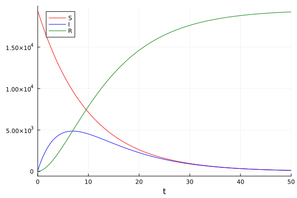
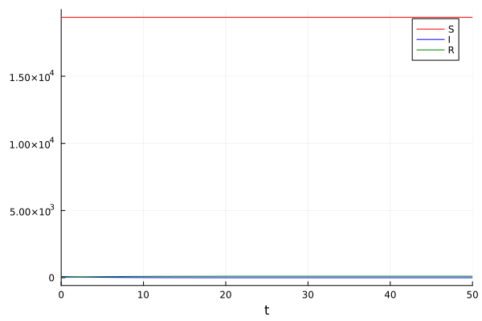
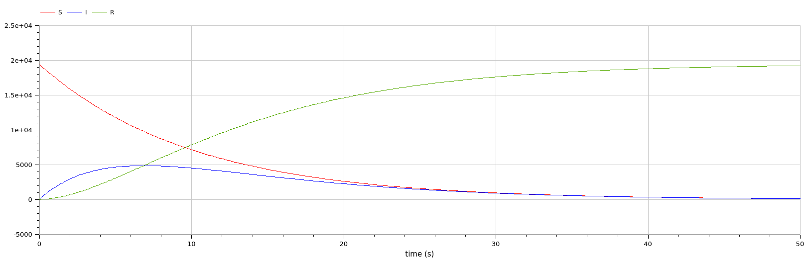
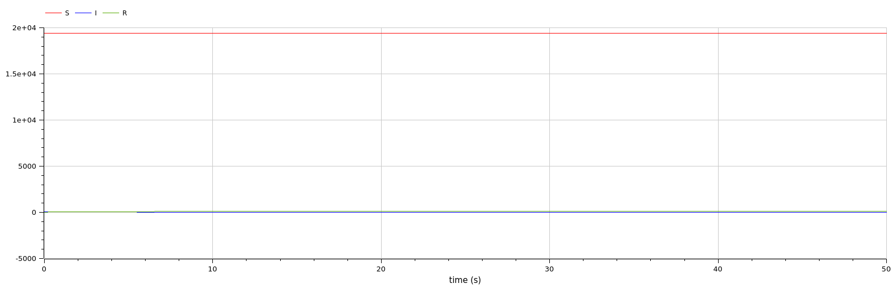

---
## Front matter
lang: ru-RU
title: Презентация по лабораторной работе 6
subtitle: 
author:
  - Матюхин Г. В.
institute:
  - Российский университет дружбы народов, Москва, Россия
date: 16 марта 2024

## i18n babel
babel-lang: russian
babel-otherlangs: english

## Formatting pdf
toc: false
toc-title: Содержание
slide_level: 2
aspectratio: 169
section-titles: true
theme: metropolis
header-includes:
 - \metroset{progressbar=frametitle,sectionpage=progressbar,numbering=fraction}
 - \usepackage{fvextra}
 - \DefineVerbatimEnvironment{Highlighting}{Verbatim}{breaklines,commandchars=\\\{\}}
 - '\makeatletter'
 - '\beamer@ignorenonframefalse'
 - '\makeatother'
---

# Цель работы

Рассмотреть модель эпидемии SIR.

## Постановка задачи

Вариант 14:
На одном острове вспыхнула эпидемия. Известно, что из всех проживающих на острове ($N = 19500$) в момент начала эпидемии ($t = 0$) число заболевших людей (являющихся распространителями инфекции) $I(0) = 88$, А число здоровых людей с иммунитетом к болезни $R(0) = 25$. Таким образом, число людей восприимчивых к болезни, но пока здоровых, в начальный момент времени $S(0) = N - I(0) - R(0)$. Постройте графики изменения числа особей в каждой из трех групп. Рассмотрите, как будет протекать эпидемия в случае:

1. если $I(0) \leq I^*$
2. если $I(0) \ge I^*$

# Выполнение работы

В этой работе требуется найти решения системы уравнений производной первого порядка.


# Julia

## Изначальные параметры

```julia
using DifferentialEquations, Plots

const tspan = (0, 50)
const N = 19500
const I0 = 88
const R0 = 25
const S0 = N - I0 - R0

const u0 = [S0, I0, R0]
```

## Основная функция

```julia
function epidemic(a, b, title)
  function _epidemic!(du, u, p, t)
    du[1] = - a * u[1] # Susceptiblel
    du[2] = a * u[1] - b * u[2] # Infectious
    du[3] = b * u[2] # Recovered
  end

  prob = ODEProblem(_epidemic!, u0, tspan)
  sol = solve(prob)

  plt = plot(sol, label=["S" "I" "R"], color=[:red :blue :green])
  savefig(plt, lowercase(string(replace(title, " "=>"_"), ".png")))
end
```

## Точка входа

```julia
a = 0.1
b = 0.2
epidemic(a, b, "Contageous")
epidemic(0, b, "Noncontageous")
```

## Результаты (1/2)



## Результаты (2/2)



# OpenModelica

```
model epidemic
  parameter Real N(start=19500);
  parameter Real I0 = 88;
  parameter Real R0 = 25;
  parameter Real S0 = N - I0 - R0;
  Real I(start=I0); Real R(start=R0); Real S(start=S0);
  parameter Real a = 0.1; parameter Real b = 0.2;
equation
  der(S) = - a * S;
  der(I) = a * S - b * I;
  der(R) = b * I;
end epidemic;
```

## Результаты (1/2)



## Результаты (2/2)



# Сравнение

Как можно увидеть, результаты моделирования как при использовании OpenModelica, так и при использовании Julia идентичны.

# Вывод

В данной лабораторной работе мы рассмотрели модель модель эпидемии SIR.
