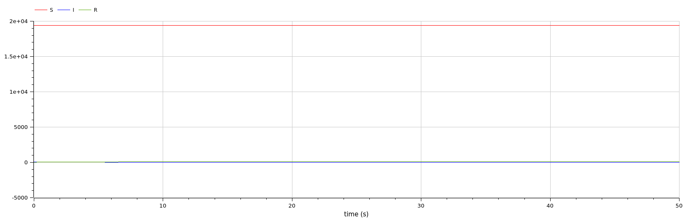

---
## Front matter
title: "Отчет по лабораторной работе 6"
subtitle: ""
author: "Матюхин Григорий Васильевич"

## Generic otions
lang: ru-RU
toc-title: "Содержание"

## Bibliography
bibliography: bib/cite.bib
csl: pandoc/csl/gost-r-7-0-5-2008-numeric.csl

## Pdf output format
toc: true # Table of contents
toc-depth: 2
lof: true # List of figures
lot: true # List of tables
fontsize: 12pt
linestretch: 1.5
papersize: a4
documentclass: scrreprt
## I18n polyglossia
polyglossia-lang:
  name: russian
  options:
	- spelling=modern
	- babelshorthands=true
polyglossia-otherlangs:
  name: english
## I18n babel
babel-lang: russian
babel-otherlangs: english
## Fonts
mainfont: PT Serif
romanfont: PT Serif
sansfont: PT Sans
monofont: PT Mono
mainfontoptions: Ligatures=TeX
romanfontoptions: Ligatures=TeX
sansfontoptions: Ligatures=TeX,Scale=MatchLowercase
monofontoptions: Scale=MatchLowercase,Scale=0.9
## Biblatex
biblatex: true
biblio-style: "gost-numeric"
biblatexoptions:
  - parentracker=true
  - backend=biber
  - hyperref=auto
  - language=auto
  - autolang=other*
  - citestyle=gost-numeric
## Pandoc-crossref LaTeX customization
figureTitle: "Рис."
tableTitle: "Таблица"
listingTitle: "Листинг"
lofTitle: "Список иллюстраций"
lotTitle: "Список таблиц"
lolTitle: "Листинги"
## Misc options
indent: true
header-includes:
  - \usepackage{indentfirst}
  - \usepackage{float} # keep figures where there are in the text
  - \floatplacement{figure}{H} # keep figures where there are in the text
---

# Цель работы

Рассмотреть модель эпидемии SIR.

## Постановка задачи

Вариант 14:
На одном острове вспыхнула эпидемия. Известно, что из всех проживающих на острове ($N = 19500$) в момент начала эпидемии ($t = 0$) число заболевших людей (являющихся распространителями инфекции) $I(0) = 88$, А число здоровых людей с иммунитетом к болезни $R(0) = 25$. Таким образом, число людей восприимчивых к болезни, но пока здоровых, в начальный момент времени $S(0) = N - I(0) - R(0)$. Постройте графики изменения числа особей в каждой из трех групп. Рассмотрите, как будет протекать эпидемия в случае:

1. если $I(0) \leq I^*$
2. если $I(0) \ge I^*$

# Выполнение работы

В этой работе требуется найти решения системы уравнений производной первого порядка.

# Julia

```julia
using DifferentialEquations, Plots

const tspan = (0, 50)
const N = 19500
const I0 = 88
const R0 = 25
const S0 = N - I0 - R0

const u0 = [S0, I0, R0]

function epidemic(a, b, title)
  function _epidemic!(du, u, p, t)
    du[1] = - a * u[1] # Susceptiblel
    du[2] = a * u[1] - b * u[2] # Infectious
    du[3] = b * u[2] # Recovered
  end

  prob = ODEProblem(_epidemic!, u0, tspan)
  sol = solve(prob)

  plt = plot(sol, label=["S" "I" "R"], color=[:red :blue :green])
  savefig(plt, lowercase(string(replace(title, " "=>"_"), ".png")))
end

a = 0.1
b = 0.2
epidemic(a, b, "Contageous")
epidemic(0, b, "Noncontageous")
```

## Результаты


# OpenModelica

```
model epidemic
  parameter Real N(start=19500);
  parameter Real I0 = 88;
  parameter Real R0 = 25;
  parameter Real S0 = N - I0 - R0;
  Real I(start=I0); Real R(start=R0); Real S(start=S0);
  parameter Real a = 0.1; parameter Real b = 0.2;
equation
  der(S) = - a * S;
  der(I) = a * S - b * I;
  der(R) = b * I;
end epidemic;
```

## Результаты




# Сравнение

Как можно увидеть, результаты моделирования как при использовании OpenModelica, так и при использовании Julia идентичны.

# Вывод

В данной лабораторной работе мы рассмотрели модель модель эпидемии SIR.
