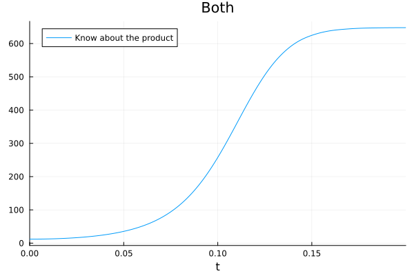
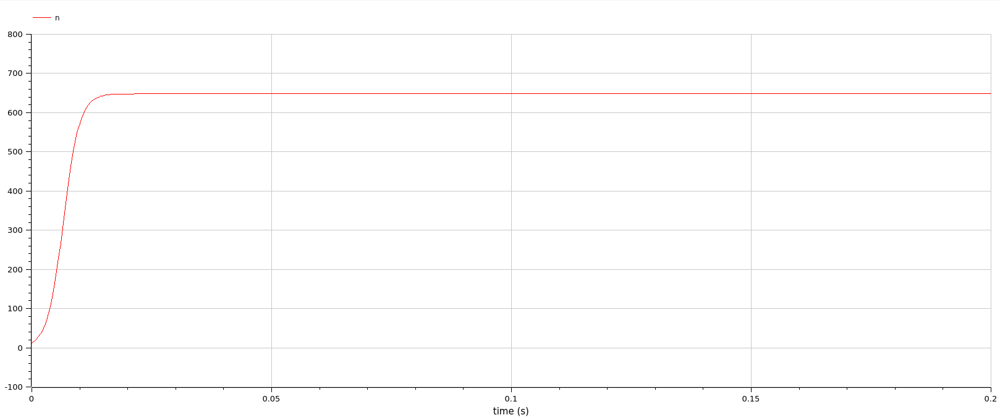

---
## Front matter
lang: ru-RU
title: Презентация по лабораторной работе 7
subtitle: 
author:
  - Матюхин Г. В.
institute:
  - Российский университет дружбы народов, Москва, Россия
date: 23 марта 2024

## i18n babel
babel-lang: russian
babel-otherlangs: english

## Formatting pdf
toc: false
toc-title: Содержание
slide_level: 2
aspectratio: 169
section-titles: true
theme: metropolis
header-includes:
 - \metroset{progressbar=frametitle,sectionpage=progressbar,numbering=fraction}
 - \usepackage{fvextra}
 - \DefineVerbatimEnvironment{Highlighting}{Verbatim}{breaklines,commandchars=\\\{\}}
 - '\makeatletter'
 - '\beamer@ignorenonframefalse'
 - '\makeatother'
---

# Цель работы

Рассмотреть модель эффективности рекламы.

## Постановка задачи

Вариант 14:
Постройте график распространения рекламы, математическая модель которой описывается следующим уравнением:

1. $\frac{dn}{dt} = \left(0.125 + 0.00002n(t)\right)\left(N - n(t)\right)$
1. $\frac{dn}{dt} = \left(0.000095 + 0.92n(t)\right)\left(N - n(t)\right)$
1. $\frac{dn}{dt} = \left(\sin(10t) + 0.9tn(t)\right)\left(N - n(t)\right)$

При этом объем аудитории $N = 648$ , в начальный момент о товаре знает 12 человек. Для случая 2 определите в какой момент времени скорость распространения рекламы будет иметь максимальное значение.

# Выполнение работы

# Julia

## Функция модели

```julia
max_dn = -Inf
time = -1
function _promotion!(du, u, p, t)
 dn = (a_1(t) + a_2(t) * u[1]) * (N - u[1])
 if dn > max_dn
   max_dn = dn
   time = t
 end
 du[1] = dn
end
```

## Решение и вывод результатов

```julia
prob = ODEProblem(_promotion!, u0, tspan)
sol = solve(prob)

plt = plot(sol, title=title, label="Know about the product")

@printf("Max dn for %s: %0.5f at %0.2f\n", title, max_dn, time)
```

## Параметры задачи

```julia
tspan = (0, 50)
a_1(t) = 0.125
a_2(t) = 0.00002
promotion(a_1, a_2, tspan, "Campaign")

tspan = (0, 0.2)
a_1(t) = 0.000095
a_2(t) = 0.92
promotion(a_1, a_2, tspan, "Word of mouth")

tspan = (0, 0.2)
a_1(t) = sin(10 * t)
a_2(t) = 0.9 * t
promotion(a_1, a_2, tspan, "Both")
```

# Результаты Julia

## Первый случай


Здесь скорость распространения имеет максимальное значение: 79.65264 в момент времени 0.00.

## Второй случай


Здесь скорость распространения имеет максимальное значение: 95087.81002 в момент времени 0.01.

## Третий случай



Здесь скорость распространения имеет максимальное значение: 10513.98670 в момент времени 0.11.

# OpenModelica

```
model promotion
  Real n(start=12);
  parameter Real N = 648;
equation
  der(n) = (sin(10 * time) + 0.9 * time * n) * (N - n);
end promotion;
```

# Результаты OpenModelica

## Первый случай


## Второй случай



## Третий случай


# Сравнение

Как можно увидеть, результаты моделирования как при использовании OpenModelica, так и при использовании Julia идентичны.

# Вывод

В данной лабораторной работе мы рассмотрели модель эффективности рекламы.
