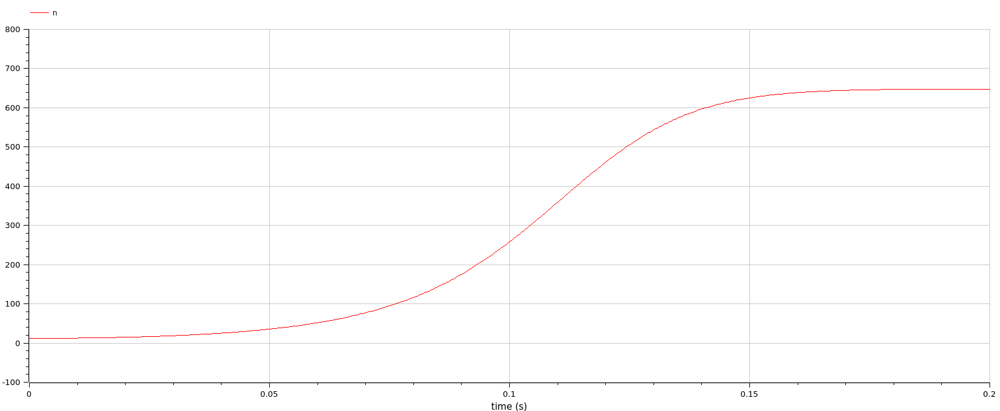

---
## Front matter
title: "Отчет по лабораторной работе 7"
subtitle: ""
author: "Матюхин Григорий Васильевич"

## Generic otions
lang: ru-RU
toc-title: "Содержание"

## Bibliography
bibliography: bib/cite.bib
csl: pandoc/csl/gost-r-7-0-5-2008-numeric.csl

## Pdf output format
toc: true # Table of contents
toc-depth: 2
lof: true # List of figures
lot: true # List of tables
fontsize: 12pt
linestretch: 1.5
papersize: a4
documentclass: scrreprt
## I18n polyglossia
polyglossia-lang:
  name: russian
  options:
	- spelling=modern
	- babelshorthands=true
polyglossia-otherlangs:
  name: english
## I18n babel
babel-lang: russian
babel-otherlangs: english
## Fonts
mainfont: PT Serif
romanfont: PT Serif
sansfont: PT Sans
monofont: PT Mono
mainfontoptions: Ligatures=TeX
romanfontoptions: Ligatures=TeX
sansfontoptions: Ligatures=TeX,Scale=MatchLowercase
monofontoptions: Scale=MatchLowercase,Scale=0.9
## Biblatex
biblatex: true
biblio-style: "gost-numeric"
biblatexoptions:
  - parentracker=true
  - backend=biber
  - hyperref=auto
  - language=auto
  - autolang=other*
  - citestyle=gost-numeric
## Pandoc-crossref LaTeX customization
figureTitle: "Рис."
tableTitle: "Таблица"
listingTitle: "Листинг"
lofTitle: "Список иллюстраций"
lotTitle: "Список таблиц"
lolTitle: "Листинги"
## Misc options
indent: true
header-includes:
  - \usepackage{indentfirst}
  - \usepackage{float} # keep figures where there are in the text
  - \floatplacement{figure}{H} # keep figures where there are in the text
---

# Цель работы

Рассмотреть модель эффективности рекламы.

## Постановка задачи

Вариант 14:
Постройте график распространения рекламы, математическая модель которой описывается следующим уравнением:

1. $\frac{dn}{dt} = \left(0.125 + 0.00002n(t)\right)\left(N - n(t)\right)$
1. $\frac{dn}{dt} = \left(0.000095 + 0.92n(t)\right)\left(N - n(t)\right)$
1. $\frac{dn}{dt} = \left(\sin(10t) + 0.9tn(t)\right)\left(N - n(t)\right)$

При этом объем аудитории $N = 648$, в начальный момент о товаре знает 12 человек. Для случая 2 определите в какой момент времени скорость распространения рекламы будет иметь максимальное значение.

# Выполнение работы

## Julia

Моделируем в Julia. 

Функция --- стандартное дифференциальное уравнение первого порядка. Но нам также нужно определить где скорость самая большая для воторого случая. Самый простой способ --- на каждом шаге моделирования обновлять переменную, хранящую текущую максимальную скорость.

```julia
max_dn = -Inf
time = -1
function _promotion!(du, u, p, t)
 dn = (a_1(t) + a_2(t) * u[1]) * (N - u[1])
 if dn > max_dn
   max_dn = dn
   time = t
 end
 du[1] = dn
end
```

Далее решаем уравнение, показываем граф и выводим максимальную скорость и точку времени где она была.

```julia
prob = ODEProblem(_promotion!, u0, tspan)
sol = solve(prob)

plt = plot(sol, title=title, label="Know about the product")

@printf("Max dn for %s: %0.5f at %0.2f\n", title, max_dn, time)
```

Предыдущие два сниппета кода находятся в одной функции `promotion`, которая позволяет легко провести симуляцию заново с другими параметрами.

```julia
tspan = (0, 50)
a_1(t) = 0.125
a_2(t) = 0.00002
promotion(a_1, a_2, tspan, "Campaign")

tspan = (0, 0.2)
a_1(t) = 0.000095
a_2(t) = 0.92
promotion(a_1, a_2, tspan, "Word of mouth")

tspan = (0, 0.2)
a_1(t) = sin(10 * t)
a_2(t) = 0.9 * t
promotion(a_1, a_2, tspan, "Both")
```

### Результаты


Здесь скорость распространения имеет максимальное значение: 79.65264 в момент времени 0.00.


Здесь скорость распространения имеет максимальное значение: 95087.81002 в момент времени 0.01.


Здесь скорость распространения имеет максимальное значение: 10513.98670 в момент времени 0.11.

## OpenModelica

Для решения, используя OpenModelica идея та же самая, но необходимо писать новую модель или изменять старую для каждой новой симуляции, т.к. используются различные функции.

Далее предоставлен код для третьего случая.

```
model promotion
  Real n(start=12);
  parameter Real N = 648;
equation
  der(n) = (sin(10 * time) + 0.9 * time * n) * (N - n);
end promotion;
```

### Результаты




# Сравнение

Как можно увидеть, результаты моделирования как при использовании OpenModelica, так и при использовании Julia идентичны.

# Вывод

В данной лабораторной работе мы рассмотрели модель эффективности рекламы.
