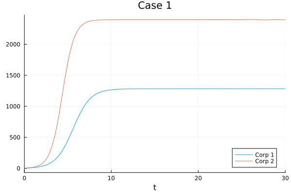
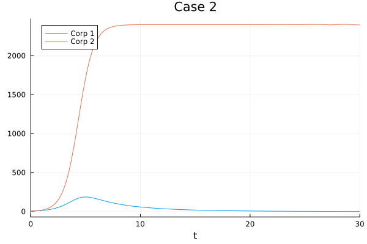
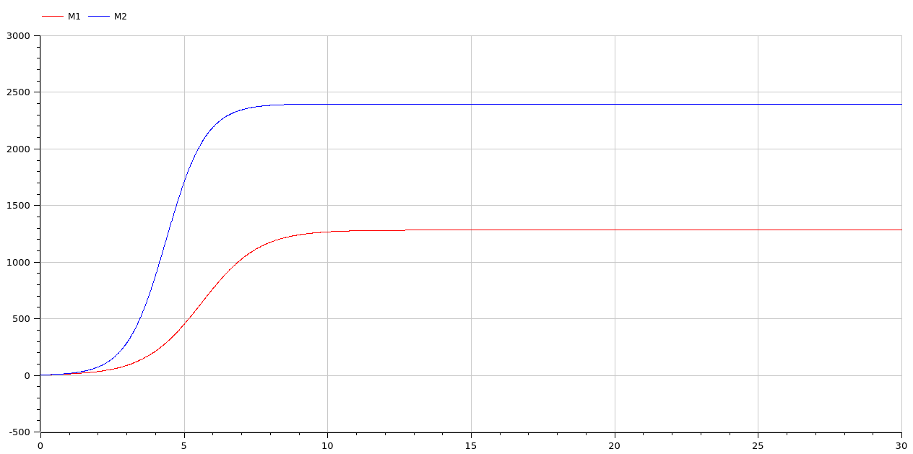

---
## Front matter
lang: ru-RU
title: Презентация по лабораторной работе 8
subtitle: 
author:
  - Матюхин Г. В.
institute:
  - Российский университет дружбы народов, Москва, Россия
date: 28 марта 2024

## i18n babel
babel-lang: russian
babel-otherlangs: english

## Formatting pdf
toc: false
toc-title: Содержание
slide_level: 2
aspectratio: 169
section-titles: true
theme: metropolis
header-includes:
 - \metroset{progressbar=frametitle,sectionpage=progressbar,numbering=fraction}
 - \usepackage{fvextra}
 - \DefineVerbatimEnvironment{Highlighting}{Verbatim}{breaklines,commandchars=\\\{\}}
 - '\makeatletter'
 - '\beamer@ignorenonframefalse'
 - '\makeatother'
---

# Цель работы

Рассмотреть модель конкуренции двух фирм.

# Постановка задачи

## Случай 1

- $\frac{dM_1}{d\theta} = M_1 - \frac{b}{c_1}M_1M_2 - \frac{a_1}{c_1}M_1^2$
- $\frac{dM_2}{d\theta} = \frac{c_2}{c_1}M_2 - \frac{b}{c_1}M_1M_2 - \frac{a_2}{c_1}M_2^2$

## Случай 2

- $\frac{dM_1}{d\theta} = M_1 - \left(\frac{b}{c_1} + 0.0005\right)M_1M_2 - \frac{a_1}{c_1}M_1^2$
- $\frac{dM_2}{d\theta} = \frac{c_2}{c_1}M_2 - \frac{b}{c_1}M_1M_2 - \frac{a_2}{c_1}M_2^2$

## Изначальные параметры

- $M_0^1 = 4.7, M_0^2 = 4.2,$
- $p_{cr} = 11.1, N = 32, q = 1,$
- $\tau_1 = 17, \tau_2 = 27,$
- $\tilde{p}_1 = 7.7, \tilde{p}_2 = 5.5$

# Выполнение работы

# Julia

## Основная функция

```julia
function _corporations!(du, u, p, t)
  du[1] = u[1] - (b/c_1 + bias) * u[1] * u[2] - (a_1/c_1) * u[1]^2
  du[2] = (c_2/c_1) * u[2] - (b/c_1) * u[1] * u[2] - (a_2/c_1) * u[2]^2
end
```

## Решение

```julia
prob = ODEProblem(_corporations!, u0, tspan)
sol = solve(prob)

plt = plot(sol, title=title, label=label)
```

## Функция-обертка

```julia
function corporations(bias, tspan, title, label)
  function _corporations!(du, u, p, t)
    du[1] = u[1] - (b/c_1 + bias) * u[1] * u[2] - (a_1/c_1) * u[1]^2
    du[2] = (c_2/c_1) * u[2] - (b/c_1) * u[1] * u[2] - (a_2/c_1) * u[2]^2
  end

  prob = ODEProblem(_corporations!, u0, tspan)
  sol = solve(prob)

  plt = plot(sol, title=title, label=label)
  savefig(plt, string(output_images_path, "/", lowercase(replace(title, " "=>"_")), ".jl.png"))
end
```

## Применени функции-обертки

```julia
corporations(0, [0, 30], "Case 1", ["Corp 1" "Corp 2"])
corporations(0.0005, [0, 30], "Case 2", ["Corp 1" "Corp 2"])
```

# Результаты Julia

## Случай 1



## Случай 2



# OpenModelica

```
model corporations
  Real M1(start=4.7), M2(start=4.2);
  parameter Real p_cr = 11.1, N = 32, q = 1, tau_1 = 17, tau_2 = 27, p_1 = 7.7, p_2 = 5.5;
  parameter Real a_1 = ..., a_2 = ..., b = ..., c_1 = ..., c_2 = ...;
  parameter Real bias = 0.0;
equation
  der(M1) = M1 - (b/c_1 + bias) * M1 * M2 - (a_1/c_1) * M1^2;
  der(M2) = (c_2/c_1) * M2 - (b/c_1) * M1 * M2 - (a_2/c_1) * M2^2;
end corporations;
```

# Результаты OpenModelica

## Случай 1



## Случай 2


# Сравнение

Как можно увидеть, результаты моделирования как при использовании OpenModelica, так и при использовании Julia идентичны.

# Вывод

В данной лабораторной работе мы рассмотрели модель конкуренции двух фирм.
