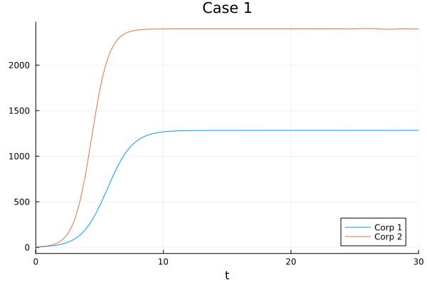
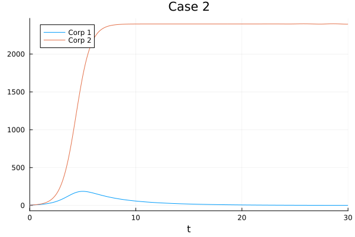
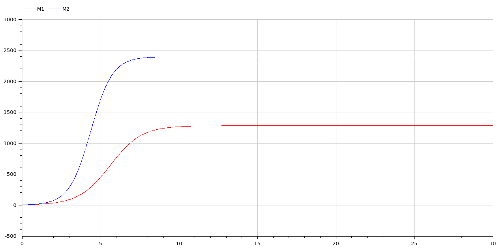
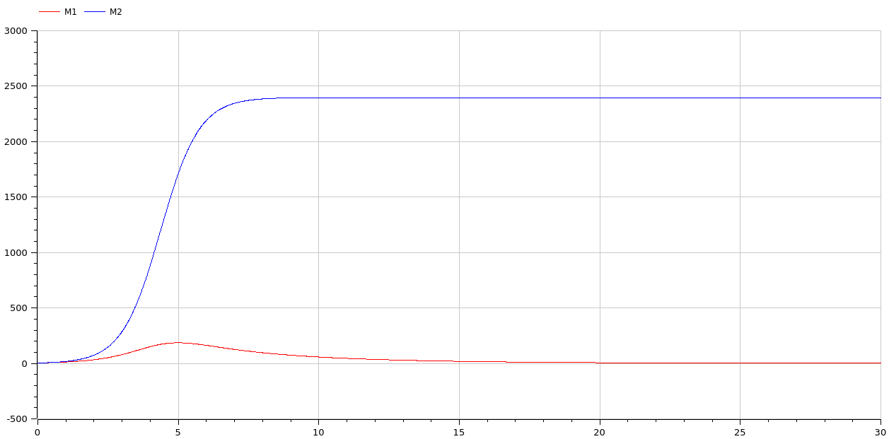

---
## Front matter
title: "Отчет по лабораторной работе 8"
subtitle: ""
author: "Матюхин Григорий Васильевич"

## Generic otions
lang: ru-RU
toc-title: "Содержание"

## Bibliography
bibliography: bib/cite.bib
csl: pandoc/csl/gost-r-7-0-5-2008-numeric.csl

## Pdf output format
toc: true # Table of contents
toc-depth: 2
lof: true # List of figures
lot: true # List of tables
fontsize: 12pt
linestretch: 1.5
papersize: a4
documentclass: scrreprt
## I18n polyglossia
polyglossia-lang:
  name: russian
  options:
	- spelling=modern
	- babelshorthands=true
polyglossia-otherlangs:
  name: english
## I18n babel
babel-lang: russian
babel-otherlangs: english
## Fonts
mainfont: PT Serif
romanfont: PT Serif
sansfont: PT Sans
monofont: PT Mono
mainfontoptions: Ligatures=TeX
romanfontoptions: Ligatures=TeX
sansfontoptions: Ligatures=TeX,Scale=MatchLowercase
monofontoptions: Scale=MatchLowercase,Scale=0.9
## Biblatex
biblatex: true
biblio-style: "gost-numeric"
biblatexoptions:
  - parentracker=true
  - backend=biber
  - hyperref=auto
  - language=auto
  - autolang=other*
  - citestyle=gost-numeric
## Pandoc-crossref LaTeX customization
figureTitle: "Рис."
tableTitle: "Таблица"
listingTitle: "Листинг"
lofTitle: "Список иллюстраций"
lotTitle: "Список таблиц"
lolTitle: "Листинги"
## Misc options
indent: true
header-includes:
  - \usepackage{indentfirst}
  - \usepackage{float} # keep figures where there are in the text
  - \floatplacement{figure}{H} # keep figures where there are in the text
---

# Цель работы

Рассмотреть модель конкуренции двух фирм.

## Постановка задачи

### Случай 1

Рассмотрим две фирмы, производящие взаимозаменяемые товары одинакового качества и находящиеся в одной рыночной нише. Считаем, что в рамках нашей модели конкурентная борьба ведётся только рыночными методами. То есть, конкуренты могут влиять на противника путем изменения параметров своего производства: себестоимость, время цикла, но не могут прямо вмешиваться в ситуацию на рынке ("назначать" цену или влиять на потребителей каким-либо иным способом.) Будем считать, что постоянные издержки пренебрежимо малы, и в модели учитывать не будем. В этом случае динамика изменения объемов продаж фирмы 1 и фирмы 2 описывается следующей системой уравнений:

- $\frac{dM_1}{d\theta} = M_1 - \frac{b}{c_1}M_1M_2 - \frac{a_1}{c_1}M_1^2$
- $\frac{dM_2}{d\theta} = \frac{c_2}{c_1}M_2 - \frac{b}{c_1}M_1M_2 - \frac{a_2}{c_1}M_2^2$

где $a_1 = \frac{p_{cr}}{\tau_1^2\tilde{p}_1^2Nq}, a_2 = \frac{p_{cr}}{\tau_2^2\tilde{p}_2^2Nq}, c_1 = \frac{p_cr - \tilde{p}_1}{\tau_1\tilde{p}_1}, c_2 = \frac{p_cr - \tilde{p}_2}{\tau_2\tilde{p}_2}$.

Также введена нормировка $t = c_1\theta$

### Случай 2

Рассмотрим модель, когда, помимо экономического фактора влияния (изменение себестоимости, производственного цикла, использование кредита и т.п.), используются еще и социально-психологические факторы -- формирование общественного предпочтения одного товара другому, не зависимо от их качества и цены. В этом случае взаимодействие двух фирм будет зависеть друг от друга, соответственно коэффициент перед $M_1M_2$ будет отличаться. Пусть в рамках рассматриваемой модели динамика изменения объемов продаж фирмы 1 и фирмы 2 описывается следующей системой уравнений:

- $\frac{dM_1}{d\theta} = M_1 - \left(\frac{b}{c_1} + 0.0005\right)M_1M_2 - \frac{a_1}{c_1}M_1^2$
- $\frac{dM_2}{d\theta} = \frac{c_2}{c_1}M_2 - \frac{b}{c_1}M_1M_2 - \frac{a_2}{c_1}M_2^2$

Для обоих случаев рассмотрим задачу со следующими начальными условиями и параметрами:

- $M_0^1 = 4.7, M_0^2 = 4.2,$
- $p_{cr} = 11.1, N = 32, q = 1,$
- $\tau_1 = 17, \tau_2 = 27,$
- $\tilde{p}_1 = 7.7, \tilde{p}_2 = 5.5$

**Замечание**: Значения $p_{cr}, \tilde{p}_{1,2}, N$ указаны в тысячах единиц, а значения $M_{1,2}$ указаны в млн. единиц.

**Обозначения**:

- $N$ -- число потребителей производимого продукта
- $\tau$ -- длительность производственного цикла
- $p$ -- рыночная цена товара
- $\tilde{p}$ -- себестоимость продукта, то есть переменные издержки на производство единицы продукции.
- $q$ -- максимальная потребность одного человека в продукте в единицу времени
- $\theta = \frac{t}{c_1}$ -- безразмерное время

**Задачи**:

1. Постройте графики изменения оборотных средств фирмы 1 и фирмы 2 без учета постоянных издержек и с веденной нормировкой для случая 1.
2. Постройте графики изменения оборотных средств фирмы 1 и фирмы 2 без учета постоянных издержек и с веденной нормировкой для случая 2.

# Выполнение работы

## Julia

Моделируем в Julia. 

Функция -- система дифференциальных уравнений первого порядка. Заметим, что в первом уравнении мы прибавляем `bias` к одному их коэффициентов. Это нужно для случая 2, а в первом случае можем задаеть его равным 0.

```julia
function _corporations!(du, u, p, t)
  du[1] = u[1] - (b/c_1 + bias) * u[1] * u[2] - (a_1/c_1) * u[1]^2
  du[2] = (c_2/c_1) * u[2] - (b/c_1) * u[1] * u[2] - (a_2/c_1) * u[2]^2
end
```

Далее решаем уравнение и показываем граф.

```julia
prob = ODEProblem(_corporations!, u0, tspan)
sol = solve(prob)

plt = plot(sol, title=title, label=label)
```

Предыдущие два сниппета кода находятся в одной функции `corporations`.

```julia
function corporations(bias, tspan, title, label)
  function _corporations!(du, u, p, t)
    du[1] = u[1] - (b/c_1 + bias) * u[1] * u[2] - (a_1/c_1) * u[1]^2
    du[2] = (c_2/c_1) * u[2] - (b/c_1) * u[1] * u[2] - (a_2/c_1) * u[2]^2
  end

  prob = ODEProblem(_corporations!, u0, tspan)
  sol = solve(prob)

  plt = plot(sol, title=title, label=label)
  savefig(plt, string(output_images_path, "/", lowercase(replace(title, " "=>"_")), ".jl.png"))
end
```

Это позволяет легко провести симуляцию заново с другими параметрами.

```julia
corporations(0, [0, 30], "Case 1", ["Corp 1" "Corp 2"])
corporations(0.0005, [0, 30], "Case 2", ["Corp 1" "Corp 2"])
```

### Результаты





## OpenModelica

Для решения, используя OpenModelica идея та же самая. Мы точно так же используем `bias` для того чтоьы не создавать дополнительныю моедль для второго случая, а просто указать параметр в общей версии.

```
model corporations
  Real M1(start=4.7), M2(start=4.2);
  parameter Real p_cr = 11.1, N = 32, q = 1, tau_1 = 17, tau_2 = 27, p_1 = 7.7, p_2 = 5.5;
  parameter Real a_1 = p_cr / (tau_1^2 * p_1^2 * N * q);
  parameter Real a_2 = p_cr / (tau_2^2 * p_2^2 * N * q);
  parameter Real b = p_cr / (tau_1^2 * p_1^2 * tau_2^2 * p_2^2 * N * q);
  parameter Real c_1 = (p_cr - p_1) / (tau_1 * p_1);
  parameter Real c_2 = (p_cr - p_2) / (tau_2 * p_2);
  parameter Real bias = 0.0;
equation
  der(M1) = M1 - (b/c_1 + bias) * M1 * M2 - (a_1/c_1) * M1^2;
  der(M2) = (c_2/c_1) * M2 - (b/c_1) * M1 * M2 - (a_2/c_1) * M2^2;
end corporations;
```

### Результаты





# Сравнение

Как можно увидеть, результаты моделирования как при использовании OpenModelica, так и при использовании Julia идентичны.

# Вывод

В данной лабораторной работе мы рассмотрели модель конкуренции двух фирм.
