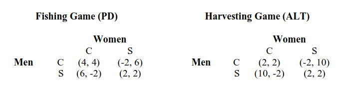
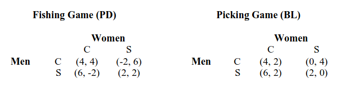

---
## Front matter
lang: ru-RU
title: Модель Беднар
subtitle: 
author:
  - Матюхин Г. В.
institute:
  - Российский университет дружбы народов, Москва, Россия
date: 8 марта 2024

## i18n babel
babel-lang: russian
babel-otherlangs: english

## Formatting pdf
toc: false
toc-title: Содержание
slide_level: 2
aspectratio: 169
section-titles: true
theme: metropolis
header-includes:
 - \metroset{progressbar=frametitle,sectionpage=progressbar,numbering=fraction}
 - \usepackage{fvextra}
 - \DefineVerbatimEnvironment{Highlighting}{Verbatim}{breaklines,commandchars=\\\{\}}
 - '\makeatletter'
 - '\beamer@ignorenonframefalse'
 - '\makeatother'
---

# Введение

В модели культуры Беднар представлена основа для понимания культурного поведения с упором на взаимодействие целевых агентов. Она сочетает в себе агентные методы и математику для исследования динамики и доказательства равновесия. Результаты обеспечивают теоретическую основу для культурного разнообразия и агентную поддержку того, как может возникнуть культурное поведение.

# Как моделировать культуру?

1. Внутрииндивидуальная последовательность: когда человек переходит от задачи к задаче, он или она реагирует одинаково.
2. Межагентная согласованность: люди в одном сообществе, сталкиваясь с одними и теми же проблемами, будут действовать одинаково.
3. Контекстуальные эффекты: представители разных сообществ могут по-разному реагировать на одну и ту же проблему или явление.
4. Поведенческая липкость: люди не могут сразу изменить свое поведение, несмотря на изменения в их стимулах.
5. Субоптимальное поведение: стратегия, используемая отдельными людьми внутри сообщества, может быть неоптимальной.

# Модель

## Игры

## Стратегии

## От Автомата к Агенту

- Агенты разделяются на две группы: агентов строк и агентов столбцов.
- Агенты строк играют только с агентами столбцов и наоборот.
- Каждый агент строки (столбца) играет с пятью соседними агентами столбца (строки).

# Пример возникновения культуры

Здесь описан пример возникнования культуры из изначальной статьи о данной модели.

## Община 1 

## Община 2 

# Результаты

## Результаты (1/3)

Во-первых, каждое из двух сообществ демонстрирует черту №1 -- внутрииндивидуальную последовательность. В первом сообществе агенты используют одну и ту же когнитивную подпрограмму «поступай с другими» в двух играх, чтобы использовать разные стратегии, хотя они могли бы использовать другие стратегии и при этом найти эффективное равновесие. Во втором случае мужчины играют эгоистично в обеих играх, несмотря на то, что они могли бы добиться большего, сотрудничая в игре "Рыбалка".

## Результаты (2/3)

Во-вторых, все агенты в первом сообществе играли "Tit For Tat" в игре "Рыбалка", а все агенты играли "Alternate" в игре "Сбор урожая", демонстрируя №2 -- межагентскую последовательность. Совместный эффект № 1 и № 2, внутриагентного и межагентного культурного поведения, создает сообщество агентов, которые действуют последовательно и одинаково. Это внутриобщинное сходство заключается в пересечении многих определений культуры, но оно не является полным. Согласованность должна объясняться особенностями окружающей среды.

## Результаты (3/3)

Третий культурный феномен -- сохранение поведенческих различий между культурами. Если бы этого не было, неоптимальность и последовательность можно было бы объяснить генетикой. В нашем примере агенты первого сообщества сотрудничали, ловя кижуча в игре "Рыбалка", но во втором сообществе и женщины, и мужчины ловили скиммеров. Разнообразие поведения в игре -- это проявление №3, контекстуальных эффектов. Ансамбль игры "Рыбалка" и игры "Сбор урожая" создает иной когнитивный контекст, чем ансамбль, состоящий из игры "Рыбалка" и игры "Сбор ягод".

# Вывод

В данном докладе мы рассмотрели моедль культуры Беднар, которая рассматривает культуру с точки зрения теории игр в аспекте координации и сотрудничества.
