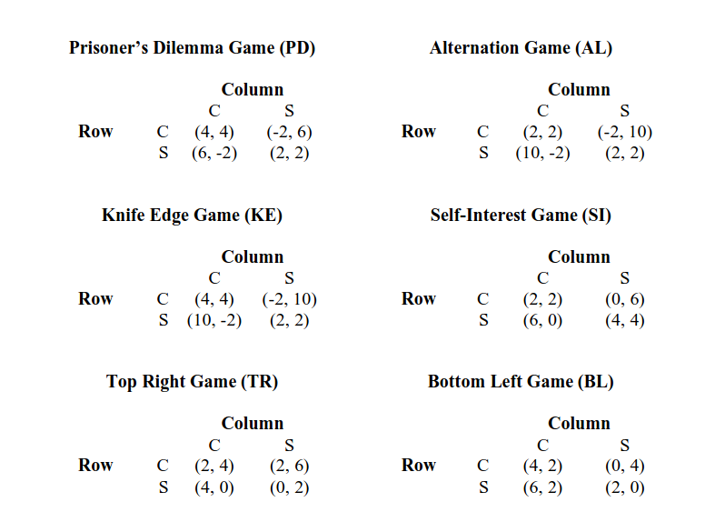
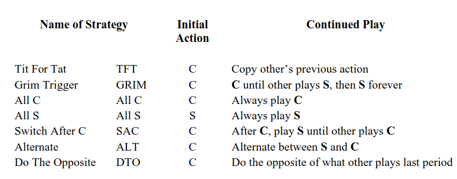
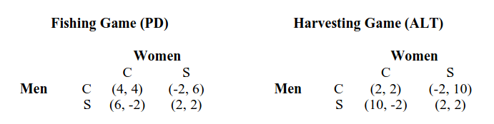
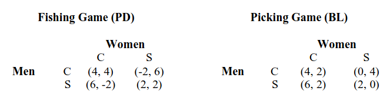

---
## Front matter
title: "Модель Беднар"
subtitle: ""
author: "Матюхин Григорий Васильевич"

## Generic otions
lang: ru-RU
toc-title: "Содержание"

## Bibliography
bibliography: bib/cite.bib
csl: pandoc/csl/gost-r-7-0-5-2008-numeric.csl

## Pdf output format
toc: true # Table of contents
toc-depth: 2
lof: true # List of figures
lot: true # List of tables
fontsize: 12pt
linestretch: 1.5
papersize: a4
documentclass: scrreprt
## I18n polyglossia
polyglossia-lang:
  name: russian
  options:
	- spelling=modern
	- babelshorthands=true
polyglossia-otherlangs:
  name: english
## I18n babel
babel-lang: russian
babel-otherlangs: english
## Fonts
mainfont: PT Serif
romanfont: PT Serif
sansfont: PT Sans
monofont: PT Mono
mainfontoptions: Ligatures=TeX
romanfontoptions: Ligatures=TeX
sansfontoptions: Ligatures=TeX,Scale=MatchLowercase
monofontoptions: Scale=MatchLowercase,Scale=0.9
## Biblatex
biblatex: true
biblio-style: "gost-numeric"
biblatexoptions:
  - parentracker=true
  - backend=biber
  - hyperref=auto
  - language=auto
  - autolang=other*
  - citestyle=gost-numeric
## Pandoc-crossref LaTeX customization
figureTitle: "Рис."
tableTitle: "Таблица"
listingTitle: "Листинг"
lofTitle: "Список иллюстраций"
lotTitle: "Список таблиц"
lolTitle: "Листинги"
## Misc options
indent: true
header-includes:
  - \usepackage{indentfirst}
  - \usepackage{float} # keep figures where there are in the text
  - \floatplacement{figure}{H} # keep figures where there are in the text
---

# Введение

В модели культуры Беднар представлена основа для понимания культурного поведения с упором на взаимодействие целевых агентов. Она сочетает в себе агентные методы и математику для исследования динамики и доказательства равновесия. Результаты обеспечивают теоретическую основу для культурного разнообразия и агентную поддержку того, как может возникнуть культурное поведение.[@model]

# Как моделировать культуру?

Эмпирические данные свидетельствуют о том, что определенные модели поведения связаны с культурой, включая идентифицируемые черты внутри одного человека, различия в поведении внутри сообщества и запаздывание в реакции на корректировку стимулов. Возможно обобщить поведения в список из пяти характеристик, подчеркнув важность культурного контекста в понимании и решении поведенческих моделей.

1. Внутрииндивидуальная последовательность: когда человек переходит от задачи к задаче, он или она реагирует одинаково.
2. Межагентная согласованность: люди в одном сообществе, сталкиваясь с одними и теми же проблемами, будут действовать одинаково.
3. Контекстуальные эффекты: представители разных сообществ могут по-разному реагировать на одну и ту же проблему или явление.
4. Поведенческая липкость: люди не могут сразу изменить свое поведение, несмотря на изменения в их стимулах.
5. Субоптимальное поведение: стратегия, используемая отдельными людьми внутри сообщества, может быть неоптимальной.

Цель моедли Беднар -- объяснить существование, а еще лучше, возникновение этих характеристик в обществе рациональных агентов.

# Модель

## Игры

В нашей системе используются игры с двумя действиями для двух человек, стимулирующие эгоизм (selfishness, S) и выгоды от сотрудничества (cooperation, C). В первых четырех играх сотрудничество снижает выигрыши, а эгоизм их повышает. В последних двух играх требуется сотрудничество, что приводит к уникальному стратегическому равновесию.

Эти шесть игр были выбраны с тем ограничением, что одна стратегия должна быть сотруднической, а другая -- эгоистичной, чтобы обеспечить максимальное разнообразие поведения.

## Стратегии

Агенты используют конечные автоматы для кодирования стратегий в играх. Эти автоматы состоят из трех частей: ментальных состояний (М), правил перехода (Т) и начальных состояний (I). Ментальные состояния пронумерованы, и каждое из них предписывает действие, например "быть эгоистичным" или "быть готовым к сотрудничеству". Количество состояний представляет когнитивные способности агента. Переходы помогают агентам обновлять свое психическое состояние в зависимости от действий противника.

Комбинации состояний и переходов можно рассматривать как когнитивные подпрограммы. Эта конструкция позволяет нам описывать компоненты культурных явлений с учетом психических состояний и когнитивных подпрограмм агентов. По сути, мы можем открыть головы агентов, просмотреть их когнитивную архитектуру и провести сравнения на основе формальных показателей.

### Автомат с двумя состояниями

Автомат с двумя состояниями имеет только два психических состояния, обозначаемых 0 и 1. Эти автоматы допускают ряд стратегических действий, включая "Grim Trigger" и "Tit For Tat". Принимается соглашение о записи двух автоматов состояний в виде списка чисел и символов, начинающегося с обозначения начального состояния, за которым следует описание каждого состояния и его переходов. Состояние можно описать как вектор длины три, например (C, 0, 1). Это конкретное состояние предписывает игроку "выбрать действие C, перейти в состояние 0, если противник играет C, и перейти в состояние 1, если оппонент играет S". Тогда мы можем записать "Tit For Tat" (TFT) как: {0, (C, 0, 1), (S, 0, 1)}. 

Помимо TFT, многие известные стратегии могут быть закодированы как автоматы с двумя состояниями.

## От Автомата к Агенту

Агенты играют в различные игры с другими членами своего сообщества. Литература по играм в автоматы сосредоточена почти исключительно на агентах, которые играют в одну игру, поэтому нет никакой оперативной разницы между стратегией автомата и агента. Но моедль Беднар требует, чтобы автоматы различали игры, а также определяли разные стратегии для каждой. Эта вожможность реализуется, добавив отдельное начальное состояние для каждой игры в ансамбле агента. 

Агенты разделяются на две группы: агентов строк и агентов столбцов. Агенты строк играют только с агентами столбцов и наоборот. Каждый агент строки (столбца) играет с пятью соседними агентами столбца (строки).

Агенты играют c подмножеством по эмпирическим, теоретическим и практическим причинам. Эмпирически явления, которые изучает модель, -- различия в поведении как функция ансамбля -- происходят посредством локальных взаимодействий. Люди взаимодействуют с друзьями и с семьей. Они, как правило, не взаимодействуют со всем населением и партнеры не выбираются случайным образом. Теоретические и практические причины связаны со скоростью распространения новых стратегий. Движение к новой равновесной стратегии более вероятно, когда взаимодействия происходят между подмножествами агентов.

# Пример возникновения культуры

Здесь описан пример возникнования культуры из изначальной статьи о данной модели.

## Описание мира

Предположим два сообщества агентов, каждое из которых играет в ансамбль из двух игр. Все агенты в одном сообществе используют один и тот же набор игр и взаимодействуют со своими соседями, играя только в эти игры.

В этом примере предполагается, что оба сообщества расположены рядом с большими водоемами, которые снабжают сообщества двумя видами рыбы: кижучом (coho) и скиммерами (skimmer). Кижуч большой, и для ловли требуется сотрудничество, а скиммеры маленькие, их легко поймать в одиночку. В каждой общине люди ловят рыбу в двухместных лодках, в которых находятся один мужчина и одна женщина. У каждого человека есть выбор из двух действий: ловить кижуча (C), или ловить скиммеров (S). Если два агента выбирают действие C, каждый из них получает положительный выигрыш. Однако у каждого есть стимул отклониться и ловить скиммеров, а затем помочь, если другой человек в это время поймает кижуча. Но если оба ловят скиммеров, им становится хуже, потому что кижуч не ловится. Итак, это классическая дилемма заключённого.

Помимо рыбалки, члены первой общины также могут добраться на лодках до близлежащего острова, чтобы собрать бананы и манго. Сбор бананов (С) -- тяжелая работа, а сбор манго (S) -- легкая работа. Однако бананы более питательны. Если оба агента собирают бананы, они получают умеренную выгоду: тяжелая работа по сбору бананов уравновешивается увеличением количества питательных веществ. Они получат одинаковую выгоду, если оба соберут манго: облегчение работы уравновешивается потерей питательной ценности. Однако если один из них собирает бананы, а другой -- манго, первый получит отрицательный выигрыш, а второй -- высокий выигрыш, поскольку второй разделит бананы, которые собрал первый, не затрачивая при этом усилий. Конкретные числовые значения выигрышей для этих двух игр приведены в таблице ниже.

Агенты могут различать эти две игры. Они знают, когда ловят рыбу и когда собирают фрукты. Таким образом, они могут использовать разные стратегии в каждой игре. Однако их когнитивные способности ограничены. Они должны использовать автомат с двумя состояниями для принятия решений. Это ограничивает стратегии, которые они могут использовать в двух играх, и может помешать им получить оптимальные выигрыши.

При использовании такой моедли оказывается, что в этом сообществе у агентов развивается поведенческая культура "поступай с другими так как хочешь чтобы поступали с тобой". В игре о рыбалке и мужчины, и женщины начинают с C. После этого стратегия "поступай с другими" становится "Tit For Tat". Используя эту стратегию, агенты поддерживают (C, C) в игре "Рыбалка". В "Сбор урожая" видно следующее поведение. В первый день женщины собирают манго (S), а мужчины -- бананы (С). В последующие дни каждый применяет правило "Tit For Tat". Результатом является чередование (C, S) и (S, C) в игре "Сбор урожая". Логика во второй игре работает так: мой партнер был хорошим (или эгоистичным) в прошлом периоде, поэтому и я буду хорошим (или эгоистичным) в этом периоде.

Члены второго сообщества также играют в рыбалку и могут отправиться на соседний остров за едой. Разница в том, что их игра по сбору еды имеет другую структуру выплат. Они могут собирать вишню или ягоды (C или S). Ягодный участок небольшой; два человека мешают друг другу, причем неуклюжие мужчины опрокидывают ведра женщин. Более того, мужчины не могут в одиночку залезть на вишневые деревья, но могут собирать вишню, если рядом есть женщины, которые могут помочь. Игра "Сбор ягод" эквивалентна игре, которую мы в нашем классе игр называем BL. В таблице ниже показаны матрицы выигрышей для игры в сбор, а также для игры в рыбалку.

Учитывая их неспособность собирать вишни, у мужчин есть доминирующая стратегия в игре «Сбор ягод», а именно S. В результате женщины в этом сообществе имеют итеративно доминирующую стратегию: C. Грубо говоря, мы можем интерпретировать поведение мужчин в игре "Сбор ягод" как эгоистичное, а поведение женщин как почтительное.

В игре "Рыбалка" мы могли бы ожидать тех же результатов, которые мы видели в первом сообществе: мужчины и женщины научатся играть "Tit For Tat", чтобы поддерживать сотрудничество, но этого не происходит. Стратегии "быть почтительным" и "поступать с другим как хочешь чтобы поступали с тобой" представляют собой совершенно разные модели поведения, и агенты не обладают достаточными когнитивными способностями, чтобы делать и то, и другое. Когда игра "Рыбалка" сочетается с игрой "Сбор ягод", мы обнаруживаем, что и мужчины, и женщины в конечном итоге выбирают S в игре "Рыбалка". Этот выбор S в игре "Рыбалка" является результатом когнитивной тени, отбрасываемой игрой «Сбор ягод».

## Результаты

В этом примере проявляется несколько явлений, которые соответствуют культурному поведению из списка в самом начале доклада.

Во-первых, каждое из двух сообществ демонстрирует черту №1 -- внутрииндивидуальную последовательность. В первом сообществе агенты используют одну и ту же когнитивную подпрограмму «поступай с другими» в двух играх, чтобы использовать разные стратегии, хотя они могли бы использовать другие стратегии и при этом найти эффективное равновесие. Во втором случае мужчины играют эгоистично в обеих играх, несмотря на то, что они могли бы добиться большего, сотрудничая в игре "Рыбалка".

Во-вторых, все агенты в первом сообществе играли "Tit For Tat" в игре "Рыбалка", а все агенты играли "Alternate" в игре "Сбор урожая", демонстрируя №2 -- межагентскую последовательность. Совместный эффект № 1 и № 2, внутриагентного и межагентного культурного поведения, создает сообщество агентов, которые действуют последовательно и одинаково. Это внутриобщинное сходство заключается в пересечении многих определений культуры, но оно не является полным. Согласованность должна объясняться особенностями окружающей среды.

Третий культурный феномен -- сохранение поведенческих различий между культурами. Если бы этого не было, неоптимальность и последовательность можно было бы объяснить генетикой. В нашем примере агенты первого сообщества сотрудничали, ловя кижуча в игре "Рыбалка", но во втором сообществе и женщины, и мужчины ловили скиммеров. Разнообразие поведения в игре -- это проявление №3, контекстуальных эффектов. Ансамбль игры "Рыбалка" и игры "Сбор урожая" создает иной когнитивный контекст, чем ансамбль, состоящий из игры "Рыбалка" и игры "Сбор ягод".

Тот факт, что разные сообщества могут и часто принимают разное поведение, лежит в основе большей части литературы по теории игр, посвященной культуре как механизму равновесного выбора. В этих моделях, если существует несколько эффективных равновесий (чтобы поприветствовать людей, мы могли бы поклониться, пожать друг другу руки или поцеловать), культура выбирает одно из них. Как правило, модели теории игр не позволяют культуре создавать неоптимальное поведение — четвертый поведенческий феномен, который мы связываем с культурой.

Во втором сообществе женщины и мужчины ловят скиммеров в игре "Рыбалка". Хотя это является равновесным поведением в однократной игре, оно не является оптимальным в повторяющейся игре, демонстрируя потенциальное возникновение неоптимального поведения. Очевидно, что неоптимальное поведение может возникать и по многим другим причинам. К ним относятся инерция, когнитивные предубеждения и неправильные убеждения. Акцент здесь на культурных эффектах, вызванных связывающими когнитивными ограничениями, подразумевается как дополнительный источник таких предубеждений, а не как замена.

# Вывод

В данном докладе мы рассмотрели моедль культуры Беднар, которая рассматривает культуру с точки зрения теории игр в аспекте координации и сотрудничества.

# Список литературы{.unnumbered}

::: {#refs}
:::
